# AsyncViewModel 동작 원리 완전 가이드 📱

> **"복잡한 앱의 상태 관리도 이제 간단하게!"**
> 
> AsyncViewModel은 SwiftUI 앱에서 복잡한 비동기 작업과 상태 관리를 쉽게 처리할 수 있게 해주는 라이브러리입니다. 이 가이드에서는 계산기 앱 예시를 통해 AsyncViewModel이 어떻게 동작하는지 단계별로 알아보겠습니다.

## 📖 목차

- [시작하기 전에](#-시작하기-전에)
- [매크로로 간편하게](#-매크로로-간편하게)
- [AsyncViewModel이란?](#-asyncviewmodel이란)
- [핵심 구성 요소](#-핵심-구성-요소)
- [데이터 흐름의 마법](#-데이터-흐름의-마법)
- [계산기 앱 스토리](#-계산기-앱-스토리-5--3--8-계산하기)
- [Effect 시스템](#-effect-시스템-비동기-작업의-핵심)
- [실제 동작 과정 상세 분석](#-실제-동작-과정-상세-분석)
- [isProcessingEffects](#-isprocessingeffects-effect-처리-동기화의-핵심)
- [고급 기능들](#-고급-기능들)
- [실제 사용 예시](#-실제-사용-예시-계산기-앱-완전-구현)
- [초급 개발자를 위한 가이드](#-초급-개발자를-위한-단계별-학습-가이드)
- [마무리](#-마무리)

## 📚 시작하기 전에

이 가이드를 읽기 전에 [README.md](../README.md)의 빠른 시작 섹션을 먼저 읽어보시길 권장합니다.

### Import 방식

```swift
// ✅ 권장: 통합 모듈 (Core + Macros 포함)
import AsyncViewModel

// Core만 필요한 경우
import AsyncViewModelCore
```

이 가이드의 모든 예제는 통합 모듈(`import AsyncViewModel`)을 사용합니다.

## 📦 패키지 구조

AsyncViewModel은 명확하게 분리된 구조로 이루어져 있습니다:

```
AsyncViewModel/
├── Sources/
│   ├── Core/                          # 내부 코어 모듈
│   │   ├── AsyncViewModelProtocol.swift   # 핵심 프로토콜
│   │   ├── AsyncEffect.swift              # Effect 타입
│   │   ├── AsyncOperation.swift           # Effect 실행 로직
│   │   ├── AsyncTestStore.swift           # 테스트 도구
│   │   ├── LogLevel.swift                 # 로깅 레벨
│   │   └── SendableError.swift            # Error 래퍼
│   └── AsyncViewModel/                # 공개 통합 모듈
│       └── AsyncViewModel.swift       # Core + Macros re-export
└── Tests/
    └── AsyncViewModelTests/
```

### 모듈 설명

| 모듈 | 타입 | 용도 |
|------|------|------|
| `AsyncViewModelCore` | Internal | 내부 코어 기능 (AsyncViewModelMacros에서 사용) |
| `AsyncViewModel` | Public | 사용자 진입점 (Core + Macros 통합) |

**사용자는 `AsyncViewModel` 하나만 import하면 모든 기능을 사용할 수 있습니다!**

```swift
import AsyncViewModel  // ✅ 이것만 import!

@AsyncViewModel  // 매크로 사용 - 프로퍼티와 extension에 @MainActor 자동 추가
final class MyViewModel: ObservableObject {
    // AsyncViewModelProtocol, AsyncEffect 등 모든 타입 사용 가능
}
```

## 🪄 매크로로 간편하게

AsyncViewModel은 `@AsyncViewModel` 매크로를 제공하여 보일러플레이트 코드를 자동으로 생성합니다.

### 매크로가 하는 일

1. **9개의 필수 프로퍼티 자동 생성**
2. **모든 생성된 프로퍼티에 `@MainActor` 자동 추가**
3. **AsyncViewModelProtocol 준수를 위한 extension 생성**
4. **Extension에도 `@MainActor` 자동 추가** - 안전한 동시성 보장

### 매크로 없이 (수동)

```swift
import AsyncViewModelCore  // Core 모듈만

@MainActor
final class MyViewModel: AsyncViewModelProtocol, ObservableObject {
    @Published var state: State
    
    // 😫 9개의 프로퍼티를 수동으로 선언해야 함
    var tasks: [CancelID: Task<Void, Never>] = [:]
    var effectQueue: [AsyncEffect<Action, CancelID>] = []
    var isProcessingEffects = false
    var actionObserver: ((Action) -> Void)?
    var isLoggingEnabled = false
    var logLevel: LogLevel = .info
    var stateChangeObserver: ((State, State) -> Void)?
    var effectObserver: ((AsyncEffect<Action, CancelID>) -> Void)?
    var performanceObserver: ((String, TimeInterval) -> Void)?
    
    // ... transform, reduce ...
}
```

### 매크로 사용 (권장)

```swift
import AsyncViewModel  // Kit + Macros 한 번에!

@AsyncViewModel  // ✨ 이 한 줄이면 끝!
final class MyViewModel: ObservableObject {
    @Published var state: State
    
    // 🎉 9개의 프로퍼티가 자동 생성됨!
    // 🎯 모든 프로퍼티와 extension에 @MainActor가 자동 추가되어 안전한 동시성 보장
    
    // ... transform, reduce ...
}
```

### 매크로 확장 결과

```swift
// 매크로가 다음과 같은 코드를 생성합니다:

final class MyViewModel: ObservableObject {
    @Published var state: State
    
    // 매크로가 생성한 프로퍼티들 (모두 @MainActor 포함)
    @MainActor public var tasks: [CancelID: Task<Void, Never>] = [:]
    @MainActor public var effectQueue: [AsyncEffect<Action, CancelID>] = []
    @MainActor public var isProcessingEffects: Bool = false
    @MainActor public var actionObserver: ((Action) -> Void)? = nil
    @MainActor public var isLoggingEnabled: Bool = true
    @MainActor public var logLevel: LogLevel = .info
    @MainActor public var stateChangeObserver: ((State, State) -> Void)? = nil
    @MainActor public var effectObserver: ((AsyncEffect<Action, CancelID>) -> Void)? = nil
    @MainActor public var performanceObserver: ((String, TimeInterval) -> Void)? = nil
}

// 매크로가 생성한 extension
@MainActor  // 🎯 extension에도 자동 추가!
extension MyViewModel: AsyncViewModelProtocol {}
```

### 매크로 파라미터

로깅을 커스터마이징할 수 있습니다:

```swift
import AsyncViewModel

// 로깅 활성화 + 디버그 레벨
@AsyncViewModel(isLoggingEnabled: true, logLevel: .debug)
final class MyViewModel: ObservableObject {
    // 매크로가 @MainActor를 모든 프로퍼티와 extension에 자동 추가
}

// 로깅 비활성화 (프로덕션)
@AsyncViewModel(isLoggingEnabled: false)
final class MyViewModel: ObservableObject {
    // 프로덕션에서도 @MainActor 안전성 보장
}
```

### 중요 사항

> 💡 **@MainActor 자동 처리**
> - 매크로가 **모든 생성된 프로퍼티**에 `@MainActor`를 자동으로 추가합니다
> - **생성된 extension**에도 `@MainActor`가 자동으로 추가됩니다
> - 따라서 클래스에 별도로 `@MainActor`를 명시할 필요가 없습니다
> - 모든 프로토콜 메서드가 안전하게 MainActor에서 실행됩니다


## 🎯 AsyncViewModel이란?

AsyncViewModel은 **단방향 데이터 흐름(Unidirectional Data Flow)**을 기반으로 한 상태 관리 시스템입니다. 

### 전통적인 방식의 문제점
```swift
// 😰 전통적인 방식 - 복잡하고 예측하기 어려움
import Foundation
import Combine

class TraditionalViewModel: ObservableObject {
    @Published var result: String = "0"
    @Published var isLoading: Bool = false
    @Published var errorMessage: String?
    
    func calculate() {
        isLoading = true
        Task {
            do {
                let result = try await someComplexCalculation()
                await MainActor.run {
                    self.result = result
                    self.isLoading = false
                }
            } catch {
                await MainActor.run {
                    self.errorMessage = error.localizedDescription
                    self.isLoading = false
                }
            }
        }
    }
}
```

### AsyncViewModel 방식
```swift
// 😊 AsyncViewModel 방식 - 깔끔하고 예측 가능
import AsyncViewModel

@AsyncViewModel  // 매크로로 보일러플레이트 자동 생성! (@MainActor 포함)
final class CalculatorAsyncViewModel: ObservableObject {
    @Published var state: State
    
    init(initialState: State = State()) {
        self.state = initialState
    }
    
    func transform(_ input: Input) -> [Action] {
        switch input {
        case .equals:
            return [.calculate]
        }
    }
    
    func reduce(state: inout State, action: Action) -> [AsyncEffect<Action, CancelID>] {
        switch action {
        case .calculate:
            return [
                .run(operation: { [calculatorUseCase] in
                    let result = try calculatorUseCase.calculate()
                    return .action(.setResult(result))
                })
            ]
        }
    }
}
```

> 💡 **`@AsyncViewModel` 매크로**는 9개의 필수 프로퍼티를 자동으로 생성하고, 모든 프로퍼티와 extension에 `@MainActor`를 자동으로 추가하여 안전한 동시성을 보장합니다. 자세한 내용은 [README - 매크로로 간편하게](README.md#매크로로-간편하게) 섹션을 참고하세요.

## 🏗️ 핵심 구성 요소

AsyncViewModel은 4가지 핵심 타입으로 구성됩니다:

### 1. Input (입력)
사용자의 행동을 나타냅니다.
```swift
enum Input: Equatable & Sendable {
    case number(Int)           // 숫자 버튼 클릭
    case operation(CalculatorOperation)  // 연산자 버튼 클릭
    case equals               // = 버튼 클릭
    case clear                // C 버튼 클릭
}
```

### 2. Action (액션)
Input을 내부적으로 처리할 수 있는 형태로 변환한 것입니다.
```swift
enum Action: Equatable & Sendable {
    case inputNumber(Int)      // 숫자 입력 처리
    case setOperation(CalculatorOperation)  // 연산자 설정
    case calculate            // 계산 실행
    case clearAll            // 모든 것 초기화
    case autoClear           // 자동 초기화
}
```

### 3. State (상태)
앱의 현재 상태를 나타냅니다.
```swift
struct State: Equatable & Sendable {
    var display: String = "0"                    // 화면에 표시될 텍스트
    var activeAlert: AlertType? = nil           // 현재 활성화된 알림
    var calculatorState: CalculatorState = .initial  // 계산기 내부 상태
    var isAutoClearTimerActive: Bool = false    // 자동 초기화 타이머 활성화 여부
}
```

### 4. CancelID (취소 식별자)
비동기 작업을 관리하기 위한 식별자입니다.
```swift
enum CancelID: Hashable, Sendable {
    case autoClearTimer  // 자동 초기화 타이머
}
```

## 🔄 데이터 흐름의 마법

AsyncViewModel의 핵심은 **단방향 데이터 흐름**입니다. 데이터는 한 방향으로만 흐릅니다:

```
사용자 입력 → Input → Action → Reduce → State 변경 + Effect 생성
```

### 전체 아키텍처 다이어그램

```mermaid
%%{init: {'theme': 'dark', 'themeVariables': {'lineColor': '#e2e8f0', 'textColor': '#f8fafc'}}}%%
graph TD
    A[👤 사용자 입력]:::user --> B[Input]:::input
    B --> C[transform 함수]:::func
    C --> D[Action]:::action
    D --> E[perform 함수]:::func
    E --> F[reduce 함수]:::func
    F --> G[📦 State 변경]:::state
    F --> H[Effect 생성]:::effect
    H --> I[Effect 큐]:::queue
    I --> J[processNextEffect]:::func
    J --> K[🌐 비동기 작업 실행]:::async
    K --> L[결과 처리]:::func
    L --> M[새로운 Action]:::action
    M --> E
    
    classDef user fill:#3b82f6,stroke:#60a5fa,color:#ffffff
    classDef input fill:#8b5cf6,stroke:#a78bfa,color:#ffffff
    classDef action fill:#8b5cf6,stroke:#a78bfa,color:#ffffff
    classDef func fill:#475569,stroke:#94a3b8,color:#ffffff
    classDef state fill:#10b981,stroke:#34d399,color:#ffffff
    classDef effect fill:#f59e0b,stroke:#fbbf24,color:#1f2937
    classDef queue fill:#f59e0b,stroke:#fbbf24,color:#1f2937
    classDef async fill:#ef4444,stroke:#f87171,color:#ffffff
```



## 📖 계산기 앱 스토리: "5 + 3 = 8" 계산하기

이제 실제 계산기 앱에서 사용자가 "5 + 3 = 8"을 계산하는 과정을 단계별로 따라해보겠습니다.

### 🎬 Scene 1: 사용자가 "5" 버튼을 누름

```swift
// 1. 사용자가 "5" 버튼을 누름
button.onTapGesture {
    viewModel.send(.number(5))  // Input 전송
}

// 2. transform 함수가 Input을 Action으로 변환
func transform(_ input: Input) -> [Action] {
    switch input {
    case .number(let digit):
        return [.inputNumber(digit)]  // [.inputNumber(5)]
    }
}

// 3. perform 함수가 Action을 처리
func perform(.inputNumber(5)) {
    // 4. reduce 함수 실행
    let effects = reduce(state: &state, action: .inputNumber(5))
}

// 5. reduce 함수에서 상태 변경 및 Effect 생성
func reduce(state: inout State, action: Action) -> [AsyncEffect<Action, CancelID>] {
    switch action {
    case .inputNumber(let digit):
        return [
            .cancel(id: CancelID.autoClearTimer),  // 기존 타이머 취소
            .action(.setTimerActive(false)),       // 타이머 비활성화
            .run(operation: { [calculatorUseCase] in
                // 6. 비동기 작업: 계산기 상태 업데이트
                let newState = try calculatorUseCase.inputNumber(
                    digit,
                    currentState: currentCalculatorState
                )
                return .action(.stateUpdated(newState))
            })
        ]
    }
}
```

### 🎬 Scene 2: "+" 버튼을 누름

```swift
// 사용자가 "+" 버튼을 누름
viewModel.send(.operation(.add))  // Input: .operation(.add)

// transform 함수 실행
func transform(_ input: Input) -> [Action] {
    switch input {
    case .operation(let op):
        return [.setOperation(op)]  // [.setOperation(.add)]
    }
}

// reduce 함수에서 연산자 설정
func reduce(state: inout State, action: Action) -> [AsyncEffect<Action, CancelID>] {
    switch action {
    case .setOperation(let operation):
        return [
            .cancel(id: CancelID.autoClearTimer),
            .action(.setTimerActive(false)),
            .run(operation: {
                let newState = try calculatorUseCase.setOperation(
                    operation,
                    currentState: currentCalculatorState
                )
                return .action(.stateUpdated(newState))
            })
        ]
    }
}
```

### 🎬 Scene 3: "3" 버튼을 누름

```swift
// 사용자가 "3" 버튼을 누름
viewModel.send(.number(3))  // Input: .number(3)

// 동일한 흐름으로 처리되어 화면에 "3"이 표시됨
```

### 🎬 Scene 4: "=" 버튼을 누름 (핵심!)

```swift
// 사용자가 "=" 버튼을 누름
viewModel.send(.equals)  // Input: .equals

// transform 함수 실행
func transform(_ input: Input) -> [Action] {
    switch input {
    case .equals:
        return [.calculate]  // [.calculate]
    }
}

// reduce 함수에서 계산 실행 및 자동 초기화 타이머 설정
func reduce(state: inout State, action: Action) -> [AsyncEffect<Action, CancelID>] {
    switch action {
    case .calculate:
        return [
            .action(.setTimerActive(true)),        // 타이머 활성화
            .run(operation: {
                // 1. 계산 실행
                let newState = try calculatorUseCase.calculate(
                    currentState: currentCalculatorState
                )
                return .action(.stateUpdated(newState))
            }),
            .run(
                id: CancelID.autoClearTimer,
                operation: {
                    // 2. 5초 후 자동 초기화
                    try await Task.sleep(nanoseconds: 5_000_000_000)
                    return .action(.autoClear)
                }
            )
        ]
    }
}
```

## ⚡ Effect 시스템: 비동기 작업의 핵심

Effect는 AsyncViewModel의 가장 강력한 기능입니다. 5가지 타입의 Effect가 있습니다:

### 1. `.action` - 다른 Action 실행
```swift
.action(.setTimerActive(true))  // 즉시 다른 Action을 실행
```

### 2. `.run` - 비동기 작업 실행
```swift
.run(operation: {
    // 백그라운드에서 실행되는 비동기 작업
    let result = try await networkRequest()
    return .action(.setResult(result))
})
```

### 3. `.cancel` - 작업 취소
```swift
.cancel(id: CancelID.autoClearTimer)  // 특정 ID의 작업 취소
```

### 4. 순차 실행 - 여러 Effect를 순차적으로 실행
```swift
[
    .action(.setLoading(true)),
    .run(operation: { /* 작업 */ }),
    .action(.setLoading(false))
]
```

### 5. `.concurrent` - 여러 Effect를 병렬 실행
```swift
.concurrent([
    .run(operation: { /* 네트워크 요청 1 */ }),
    .run(operation: { /* 네트워크 요청 2 */ })
])  // 두 요청이 동시에 실행됨!
```

### Effect 처리 흐름 다이어그램

```mermaid
%%{init: {'theme': 'dark', 'themeVariables': {'lineColor': '#e2e8f0', 'textColor': '#f8fafc'}}}%%
graph TD
    A[📥 Effect 큐]:::queue --> B{큐가 비어있나?}:::decision
    B -->|아니오| C[첫 번째 Effect 가져오기]:::process
    B -->|예| D[✅ 처리 완료]:::complete
    
    C --> E{Effect 타입}:::decision
    E -->|.action| F[⚙️ Action 실행]:::action
    E -->|.run| G[🌐 비동기 작업 실행]:::async
    E -->|.cancel| H[❌ 작업 취소]:::cancel
    E -->|배열| I[📋 순차 실행]:::sequential
    E -->|.concurrent| J[⚡ 병렬 실행]:::concurrent
    
    F --> K[새로운 Effect 생성]:::effect
    G --> L[작업 완료 후 결과 처리]:::result
    H --> M[작업 제거]:::remove
    I --> N[각 Effect 순차 처리]:::process
    J --> O[모든 Effect 병렬 처리]:::process
    
    K --> A
    L --> K
    N --> A
    O --> A
    
    classDef queue fill:#f59e0b,stroke:#fbbf24,color:#1f2937
    classDef decision fill:#8b5cf6,stroke:#a78bfa,color:#ffffff
    classDef process fill:#475569,stroke:#94a3b8,color:#ffffff
    classDef complete fill:#10b981,stroke:#34d399,color:#ffffff
    classDef action fill:#3b82f6,stroke:#60a5fa,color:#ffffff
    classDef async fill:#ef4444,stroke:#f87171,color:#ffffff
    classDef cancel fill:#ef4444,stroke:#f87171,color:#ffffff
    classDef sequential fill:#f59e0b,stroke:#fbbf24,color:#1f2937
    classDef concurrent fill:#8b5cf6,stroke:#a78bfa,color:#ffffff
    classDef effect fill:#475569,stroke:#94a3b8,color:#ffffff
    classDef result fill:#475569,stroke:#94a3b8,color:#ffffff
    classDef remove fill:#475569,stroke:#94a3b8,color:#ffffff
```



### 📖 Effect 타입별 상세 설명

#### 1. `.action` - 즉시 실행되는 Action
```swift
.action(.setTimerActive(true))
```
- **언제 사용**: 상태를 즉시 변경해야 할 때
- **실행 시점**: Effect 큐에서 즉시 처리
- **주의사항**: 상태 변경은 MainActor에서만 안전

#### 2. `.run` - 비동기 작업 실행
```swift
.run(operation: {
    // 백그라운드에서 실행되는 비동기 작업
    let result = try await networkRequest()
    return .action(.setResult(result))
})
```
- **언제 사용**: 네트워크 요청, 파일 읽기, 계산 등 시간이 걸리는 작업
- **실행 시점**: 백그라운드 스레드에서 실행
- **반환값**: 새로운 Action이나 에러

#### 3. `.cancel` - 작업 취소
```swift
.cancel(id: CancelID.autoClearTimer)
```
- **언제 사용**: 더 이상 필요하지 않은 작업을 중단할 때
- **실행 시점**: 즉시 해당 ID의 작업을 취소
- **주의사항**: 취소된 작업은 복구할 수 없음

#### 4. 순차 실행
```swift
[
    .action(.setLoading(true)),
    .run(operation: { /* 작업 */ }),
    .action(.setLoading(false))
]
```
- **언제 사용**: 작업을 순서대로 실행해야 할 때
- **실행 방식**: 첫 번째 → 두 번째 → 세 번째 순서로 실행
- **장점**: 예측 가능한 실행 순서

#### 5. `.concurrent` - 병렬 실행
```swift
.concurrent([
    .run(operation: { /* 네트워크 요청 1 */ }),
    .run(operation: { /* 네트워크 요청 2 */ })
])
```
- **언제 사용**: 독립적인 작업들을 동시에 실행할 때
- **실행 방식**: 모든 작업이 동시에 시작
- **장점**: 빠른 실행 시간

## 🔄 실제 동작 과정 상세 분석

사용자가 "5" 버튼을 누르는 과정을 단계별로 자세히 알아보겠습니다.

### Step 1: Input 전송 🎯
```swift
// SwiftUI View에서
Button("5") {
    viewModel.send(.number(5))  // Input 전송
}
```

**무슨 일이 일어나나요?**
- 사용자가 버튼을 누름
- `viewModel.send(.number(5))` 호출
- AsyncViewModel 내부의 `perform()` 메서드가 호출됨

### Step 2: Transform 단계 🔄
```swift
func transform(_ input: Input) -> [Action] {
    switch input {
    case .number(let digit):
        return [.inputNumber(digit)]  // [.inputNumber(5)]
    }
}
```

**무슨 일이 일어나나요?**
- 사용자 입력을 내부적으로 처리할 수 있는 Action으로 변환
- `.number(5)` → `.inputNumber(5)`
- 이 단계에서는 상태 변경 없음

### Step 3: Perform 단계 ⚡
```swift
func perform(_ action: Action) {
    // 1. 액션 로깅 (디버깅용)
    logAction(action)
    
    // 2. 이전 상태 저장 (변경 감지용)
    let oldState = state
    
    // 3. 상태 변경 및 Effect 생성
    let effects = reduce(state: &state, action: action)
    
    // 4. 상태 변경 로깅 (디버깅용)
    if oldState != state {
        logStateChange(from: oldState, to: state)
    }
    
    // 5. Effect 큐에 추가
    effectQueue.append(contentsOf: effects)
    
    // 6. 다음 Effect 처리 시작
    Task {
        await processNextEffect()
    }
}
```

**무슨 일이 일어나나요?**
1. **로깅**: 디버깅을 위해 액션을 기록
2. **상태 백업**: 변경 전 상태를 저장
3. **상태 변경**: `reduce()` 함수 호출로 상태 변경
4. **Effect 생성**: 새로운 비동기 작업들을 생성
5. **큐 추가**: 생성된 Effect들을 큐에 추가
6. **처리 시작**: 백그라운드에서 Effect 처리 시작

### Step 4: Reduce 단계 🏗️
```swift
func reduce(state: inout State, action: Action) -> [AsyncEffect<Action, CancelID>] {
    switch action {
    case .inputNumber(let digit):
        return [
            .cancel(id: CancelID.autoClearTimer),  // 기존 타이머 취소
            .action(.setTimerActive(false)),       // 타이머 비활성화
            .run(operation: { [calculatorUseCase] in
                // 비동기 작업: 계산기 상태 업데이트
                let newState = try calculatorUseCase.inputNumber(
                    digit,
                    currentState: currentCalculatorState
                )
                return .action(.stateUpdated(newState))
            })
        ]
    }
}
```

**무슨 일이 일어나나요?**
1. **타이머 취소**: 기존에 실행 중인 자동 초기화 타이머를 중단
2. **상태 변경**: 타이머 활성화 상태를 false로 변경
3. **비동기 작업**: 백그라운드에서 계산기 상태를 업데이트
4. **결과 반환**: 새로운 상태를 담은 Action 반환

### Step 5: Effect 처리 🔄
```swift
private func processNextEffect() async {
    guard !isProcessingEffects else { return }  // 중복 처리 방지
    isProcessingEffects = true
    
    while !effectQueue.isEmpty {
        let effect = effectQueue.removeFirst()
        await handleEffect(effect)  // 각 Effect 순차 처리
    }
    
    isProcessingEffects = false
}
```

**무슨 일이 일어나나요?**
1. **중복 방지**: 이미 처리 중이면 대기
2. **순차 처리**: Effect 큐의 각 항목을 하나씩 처리
3. **완료 표시**: 모든 처리 완료 후 플래그 해제

### 📊 전체 과정 시각화

```mermaid
%%{init: {'theme': 'dark', 'themeVariables': {'lineColor': '#e2e8f0', 'textColor': '#f8fafc'}}}%%
graph TD
    A["👤 사용자가 5 버튼 클릭"]:::user --> B["send(.number(5))"]:::send
    B --> C["🔄 transform 함수 호출"]:::func
    C --> D["Input → Action 변환"]:::transform
    D --> E["⚙️ perform 함수 호출"]:::func
    E --> F["📝 reduce 함수 호출"]:::func
    F --> G["📦 상태 변경 + Effect 생성"]:::state
    G --> H["📥 Effect 큐에 추가"]:::queue
    H --> I["🔄 processNextEffect 시작"]:::func
    I --> J["⚡ 각 Effect 순차 처리"]:::process
    J --> K["📱 UI 업데이트"]:::ui
    
    classDef user fill:#3b82f6,stroke:#60a5fa,color:#ffffff
    classDef send fill:#8b5cf6,stroke:#a78bfa,color:#ffffff
    classDef func fill:#475569,stroke:#94a3b8,color:#ffffff
    classDef transform fill:#8b5cf6,stroke:#a78bfa,color:#ffffff
    classDef state fill:#10b981,stroke:#34d399,color:#ffffff
    classDef queue fill:#f59e0b,stroke:#fbbf24,color:#1f2937
    classDef process fill:#ef4444,stroke:#f87171,color:#ffffff
    classDef ui fill:#10b981,stroke:#34d399,color:#ffffff
```



### ⏱️ 시간순 실행 과정

```
시간 0ms:    사용자가 "5" 버튼 클릭
시간 1ms:    transform() 실행 → .inputNumber(5) 생성
시간 2ms:    perform() 실행 → reduce() 호출
시간 3ms:    reduce() 실행 → 상태 변경 + Effect 생성
시간 4ms:    Effect 큐에 추가
시간 5ms:    processNextEffect() 시작
시간 6ms:    .cancel Effect 실행 (타이머 취소)
시간 7ms:    .action Effect 실행 (타이머 비활성화)
시간 8ms:    .run Effect 실행 (백그라운드에서 계산기 상태 업데이트)
시간 15ms:   .run Effect 완료 → 새로운 Action 반환
시간 16ms:   새로운 Action 처리 → UI 업데이트
```

## 🔒 isProcessingEffects: Effect 처리 동기화의 핵심

`isProcessingEffects`는 AsyncViewModel에서 **Effect 처리 과정의 동시성을 제어하는 핵심 플래그**입니다. 이 플래그는 Effect 큐가 현재 처리 중인지 여부를 나타내며, 중복 처리를 방지하는 중요한 역할을 합니다.

### 📋 기본 개념

```swift
/// Effect 처리 상태
var isProcessingEffects: Bool { get set }
```

- **타입**: `Bool`
- **역할**: Effect 큐 처리 상태를 추적
- **목적**: 동시 Effect 처리를 방지하여 데이터 일관성 보장

### 🎯 주요 역할과 동작 원리

#### 1. **중복 처리 방지** 🚫

```swift
private func processNextEffect() async {
    guard !isProcessingEffects else { return }  // 🔒 이미 처리 중이면 종료
    isProcessingEffects = true                  // 🔒 처리 시작 표시

    while !effectQueue.isEmpty {
        let effect = effectQueue.removeFirst()
        await handleEffect(effect)
    }

    isProcessingEffects = false                 // 🔓 처리 완료 표시
}
```

**왜 필요한가?**
- 사용자가 빠르게 여러 버튼을 연속으로 누를 수 있음
- 각 버튼 클릭마다 `perform()` → `processNextEffect()` 호출됨
- 플래그 없이는 여러 개의 Effect 처리 루프가 동시에 실행될 수 있음

#### 2. **이중 보호 시스템** 🛡️

AsyncViewModel에는 **두 개의 `isProcessingEffects` 체크**가 있습니다:

```swift
// 첫 번째 체크: 진입점 보호
private func processNextEffect() async {
    guard !isProcessingEffects else { return }  // 🛡️ 외부 호출 시 중복 방지
    isProcessingEffects = true
    // ... Effect 처리 ...
    isProcessingEffects = false
}

// 두 번째 체크: 재귀 호출 제어
case .action(let action):
    // ... 상태 변경 및 Effect 생성 ...
    
    // 새로 추가된 효과들을 즉시 처리 (현재 처리 중이 아닐 때만)
    if !self.isProcessingEffects {  // 🔄 재귀 호출 방지
        Task {
            await self.processNextEffect()
        }
    }
```

**두 체크의 차이점:**
- **첫 번째 체크**: 외부에서의 **동시 호출 방지**
- **두 번째 체크**: 내부에서의 **적절한 재귀 호출 제어**

### 📊 실제 동작 시나리오

#### 비동기 작업 완료 후 Effect 처리

```swift
// 계산기 예시: 자동 초기화 타이머
.run(
    id: CancelID.autoClearTimer,
    operation: {
        try await Task.sleep(nanoseconds: 5_000_000_000)  // 5초 대기
        return .action(.autoClear)  // 새로운 Action 생성
    }
)

// 실행 순서:
// 1. processNextEffect() 시작 → isProcessingEffects = true
// 2. .run Effect 시작 → 비동기 작업 시작
// 3. while 루프 완료 → isProcessingEffects = false
// 4. 5초 후 비동기 작업 완료 → 새로운 Effect 큐에 추가
// 5. 두 번째 체크: !isProcessingEffects → true (루프 완료됨)
// 6. processNextEffect() 호출 → 새로운 Effect 처리
```

### 🚨 두 번째 체크가 필요한 이유

비동기 작업 완료 시점에 다른 `processNextEffect()`가 실행 중일 수 있어서, 첫 번째 체크에서 대부분 return되거나 새로운 Effect가 처리되지 않을 수 있습니다. 따라서 적절한 재귀 호출 제어가 필요합니다.

## 🚀 고급 기능들

### 1. 병렬 처리 (Concurrent Effects)의 내부 동작

`concurrent` Effect에서 `.action`과 `.cancel`이 순차 처리되는 이유:

#### 🔍 처리 전략
1. **`.run` 효과들의 operation은 병렬로 실행** (백그라운드 스레드)
2. **모든 operation 결과를 수집한 후 MainActor에서 순차 처리**
3. **비-.run 효과들(.action, .cancel 등)은 순차 처리**

#### 🎯 왜 순차 처리해야 하는가?

**상태 일관성 보장**: 동시에 여러 Action이 상태를 변경하면 예측 불가능한 결과가 발생할 수 있습니다.

```swift
// 안전한 순차 처리
.concurrent([
    .action(.setLoading(true)),     // 상태: loading = true
    .action(.setUser("Alice")),     // 상태: user = "Alice"  
    .action(.setLoading(false)),    // 상태: loading = false
    .action(.setUser("Bob"))        // 상태: user = "Bob"
])
// 최종 상태: loading = false, user = "Bob" ✅

// 위험한 병렬 처리 (만약 구현된다면)
// 동시에 여러 Action이 상태를 변경하면 예측 불가능한 결과! ❌
```

**MainActor 안전성**: `.action`과 `.cancel`은 모두 MainActor에서 실행되어야 합니다.

#### 📊 Concurrent Effect 처리 과정 상세 분석

실제 예시를 통해 concurrent Effect가 어떻게 처리되는지 단계별로 알아보겠습니다.

##### 📋 예시: 사용자 데이터 병렬 로딩

```swift
case .loadUserData:
    return [
        .concurrent([
            .run(operation: {
                let profile = try await fetchUserProfile()
                return .action(.setProfile(profile))
            }),
            .run(operation: {
                let settings = try await fetchUserSettings()
                return .action(.setSettings(settings))
            }),
            .run(operation: {
                let notifications = try await fetchNotifications()
                return .action(.setNotifications(notifications))
            })
        ])
    ]
```

##### 🔄 3단계 처리 과정

**1단계: 백그라운드에서 병렬 실행** ⚡

```swift
// 1단계: .run Effect들을 백그라운드에서 병렬 실행
for (index, effect) in effects.enumerated() {
    if case .run(_, let operation) = effect {
        group.addTask {  // 🚀 백그라운드 Task 생성
            let result = await operation()  // 네트워크 요청 실행
            return (index, result)          // 결과와 인덱스 반환
        }
    }
}
```

**실행 과정:**

```mermaid
%%{init: {'theme': 'dark', 'themeVariables': {'lineColor': '#e2e8f0', 'textColor': '#f8fafc'}}}%%
graph TD
    A[⚡ concurrent 시작]:::start --> B[📋 Effect 목록 분석]:::process
    B --> C[🌐 .run Effect 1:<br/>fetchUserProfile]:::effect
    B --> D[🌐 .run Effect 2:<br/>fetchUserSettings]:::effect
    B --> E[🌐 .run Effect 3:<br/>fetchNotifications]:::effect
    
    C --> F[📦 TaskGroup에 추가]:::group
    D --> F
    E --> F
    
    F --> G[⚡ 3개 Task가<br/>백그라운드에서<br/>병렬 실행]:::parallel
    
    classDef start fill:#8b5cf6,stroke:#a78bfa,color:#ffffff
    classDef process fill:#475569,stroke:#94a3b8,color:#ffffff
    classDef effect fill:#ef4444,stroke:#f87171,color:#ffffff
    classDef group fill:#8b5cf6,stroke:#a78bfa,color:#ffffff
    classDef parallel fill:#10b981,stroke:#34d399,color:#ffffff
```


**실제 실행:**
```
시간 0ms:   Task 1 시작 (fetchUserProfile)
시간 0ms:   Task 2 시작 (fetchUserSettings)  
시간 0ms:   Task 3 시작 (fetchNotifications)

시간 200ms: Task 2 완료 (settings 데이터)
시간 300ms: Task 1 완료 (profile 데이터)
시간 500ms: Task 3 완료 (notifications 데이터)
```

**2단계: 모든 결과 수집** 📦

```swift
// 2단계: 모든 operation 결과 수집
var results: [(index: Int, result: AsyncOperationResult<Action>)] = []
for await (index, result) in group {
    if let result = result {
        results.append((index, result))
    }
}

// 수집된 결과:
// results = [
//   (1, .action(.setProfile(profileData))),
//   (0, .action(.setSettings(settingsData))),
//   (2, .action(.setNotifications(notificationsData)))
// ]
```

**3단계: MainActor에서 순차 처리** 🎭

```swift
// 3단계: MainActor에서 결과들과 다른 효과들을 순차 처리
for (index, effect) in effects.enumerated() {
    switch effect {
    case .run(let id, _):
        // operation 결과 찾기
        if let operationResult = results.first(where: { $0.index == index })?.result {
            // 결과 처리 (operation은 이미 실행됨)
            switch operationResult {
            case .action(let action):
                // MainActor에서 상태 변경
                let effects = self.reduce(state: &self.state, action: action)
                // ...
            }
        }
    default:
        // 비-.run 효과들은 순차 처리
        await handleEffect(effect)
    }
}
```

**순차 처리 과정:**

```mermaid
graph TD
    A[MainActor에서 순차 처리 시작] --> B[index 0: profileData 처리]
    B --> C[reduce 함수 실행 - setProfile]
    C --> D[state.profile = profileData]
    D --> E[index 1: settingsData 처리]
    E --> F[reduce 함수 실행 - setSettings]
    F --> G[state.settings = settingsData]
    G --> H[index 2: notificationsData 처리]
    H --> I[reduce 함수 실행 - setNotifications]
    I --> J[state.notifications = notificationsData]
    J --> K[처리 완료]
    
    style A fill:#166534,stroke:#22c55e,stroke-width:2px,color:#ffffff
    style K fill:#166534,stroke:#22c55e,stroke-width:2px,color:#ffffff
```


##### 🕐 시간축으로 보는 전체 과정

```
시간축: 0ms ──────────────────────────────────────────────── 500ms

Task 실행 (백그라운드):
Task 1 (profile):     ████████████████████████████████████████ (300ms)
Task 2 (settings):    ████████████████ (200ms)
Task 3 (notifications): ████████████████████████████████████████████ (500ms)

상태 변경 (일괄):
profile:              대기... 대기... 대기... █ (500ms) ← 마지막에 변경
settings:             대기... 대기... 대기... █ (500ms) ← 마지막에 변경
notifications:        대기... 대기... 대기... █ (500ms) ← 마지막에 변경
```

##### 🎯 왜 이렇게 복잡하게 처리하는가?

**문제 상황 (단순한 접근법)** ❌

```swift
// 만약 단순하게 처리한다면?
.concurrent([
    .run(operation: { 
        let profile = try await fetchUserProfile()
        // ❌ 백그라운드에서 상태 변경 시도
        self.state.profile = profile  // 크래시!
    })
])
```

**해결 방법 (현재 방식)** ✅

```swift
// 1. 백그라운드에서 데이터만 가져오기
.run(operation: { 
    let profile = try await fetchUserProfile()
    return .action(.setProfile(profile))  // 결과만 반환
})

// 2. MainActor에서 안전하게 상태 변경
case .action(.setProfile(let profile)):
    state.profile = profile  // 안전!
```

##### 💡 핵심 포인트

1. **병렬 실행**: 실제 비동기 작업(네트워크, DB)이 백그라운드에서 동시 실행
2. **결과 수집**: 모든 작업 완료를 기다린 후 결과를 한 번에 수집
3. **순차 처리**: MainActor에서 상태 변경을 안전하게 순서대로 처리
4. **성능 + 안전성**: 병렬 실행의 이점 + 상태 일관성 보장

이렇게 **3단계 분리 처리**를 통해 성능과 안전성을 모두 확보하는 것이 `concurrent` Effect의 핵심입니다! 🎯

### 3. 실제 사용 예시 비교

#### 📋 상황 1: 데이터 간 의존성이 있는 경우

```swift
// 사용자 정보를 먼저 가져온 후, 그 정보로 프로필을 가져와야 하는 경우
case .loadUserProfile:
    return [
        .run(operation: {
            let user = try await fetchUser()
            return .action(.setUser(user))
        }),
        .run(operation: {
            // user.id가 필요한 경우 - 순차 실행 필요!
            let profile = try await fetchProfile(userId: user.id)
            return .action(.setProfile(profile))
        })
    ]
```

**왜 순차 실행이 필요한가?**
- 두 번째 작업이 첫 번째 작업의 결과에 의존
- 사용자 ID를 먼저 가져온 후 프로필을 가져와야 함

#### 📋 상황 2: 독립적인 데이터를 빠르게 로드하는 경우

```swift
// 프로필, 설정, 알림을 동시에 가져오는 경우
case .loadDashboard:
    return [
        .concurrent([
            .run(operation: {
                let profile = try await fetchUserProfile()
                return .action(.setProfile(profile))
            }),
            .run(operation: {
                let settings = try await fetchUserSettings()
                return .action(.setSettings(settings))
            }),
            .run(operation: {
                let notifications = try await fetchNotifications()
                return .action(.setNotifications(notifications))
            })
        ])
    ]
```

**왜 병렬 실행이 좋은가?**
- 세 작업 모두 독립적
- 동시에 실행하면 3배 빠름
- 사용자가 더 빠르게 화면을 볼 수 있음

#### 📋 상황 3: 순차적 로딩 UI를 원하는 경우

```swift
// 진행률 표시와 함께 단계별로 로딩하는 경우
case .loadWithProgress:
    return [
        .run(operation: {
            let step1 = try await loadStep1()
            return .action(.setProgress(25))
        }),
        .run(operation: {
            let step2 = try await loadStep2()
            return .action(.setProgress(50))
        }),
        .run(operation: {
            let step3 = try await loadStep3()
            return .action(.setProgress(100))
        })
    ]
```

**왜 순차 실행이 좋은가?**
- 사용자에게 진행 상황을 단계별로 보여줄 수 있음
- 각 단계마다 UI 업데이트 가능

### 2. Effect 처리 방식 비교: Concurrent vs 순차 처리

실제로는 **Concurrent**와 **순차 처리** 두 가지 방식만 있습니다. merge와 별개 .run은 동일한 순차 처리를 다르게 표현한 것뿐입니다.

#### ⚡ Concurrent Effect (병렬 처리)

```swift
case .loadUserData:
    return [
        .concurrent([
            .run(operation: { /* 프로필 데이터 */ }),
            .run(operation: { /* 설정 데이터 */ }),
            .run(operation: { /* 알림 데이터 */ })
        ])
    ]

// 시간축: 0ms ──────────────────────────────────────────────── 500ms
// 병렬 실행 (백그라운드):
// Task 1 (profile):     ████████████████████████████████████████ (300ms)
// Task 2 (settings):    ████████████████ (200ms)
// Task 3 (notifications): ████████████████████████████████████████████ (500ms)
// 상태 변경: 모든 작업 완료 후 일괄 처리
// 총 소요 시간: 500ms
```

**특징:**
- 모든 작업이 동시에 시작
- 가장 빠른 실행 시간
- 상태 변경은 모든 작업 완료 후 일괄 처리
- 리소스 사용량 높음

#### ⏳ 순차 처리

**순차 처리 방법**
```swift
case .loadUserData:
    return [
        .run(operation: { /* 프로필 데이터 */ }),
        .run(operation: { /* 설정 데이터 */ }),
        .run(operation: { /* 알림 데이터 */ })
    ]

// 시간축: 0ms ──────────────────────────────────────────────── 1000ms
// 순차 실행:
// Task 1 (profile):     ████████████████████████████████████████ (300ms)
// Task 2 (settings):                          ████████████████████████████ (200ms)
// Task 3 (notifications):                                        ████████████████████████████████████████████████████████████ (500ms)
// 상태 변경: 각 작업 완료 시마다 개별 처리
// 총 소요 시간: 1000ms
```

**특징:**
- 작업들이 순서대로 실행
- 각 작업 완료 시마다 상태 변경
- 예측 가능한 실행 순서
- 리소스 사용량 낮음

#### 📊 2가지 방식 비교표

| 구분 | Concurrent | 순차 처리 |
|------|------------|-----------|
| **실행 방식** | 병렬 | 순차 |
| **총 소요 시간** | 500ms | 1000ms |
| **상태 변경 시점** | 모든 작업 완료 후 일괄 | 각 작업 완료 시마다 |
| **UI 업데이트** | 1번 (마지막에) | 3번 (각각) |
| **리소스 사용량** | 높음 | 낮음 |
| **예측 가능성** | 낮음 | 높음 |
| **문법 복잡도** | 중간 | 낮음 |

#### 🎯 언제 어떤 방식을 사용해야 할까?

**Concurrent 사용 시기:**
- 독립적인 데이터를 동시에 로드할 때
- 빠른 로딩이 중요한 경우
- 모든 데이터가 준비된 후 화면을 업데이트하고 싶을 때

```swift
// 예시: 대시보드 초기 로딩
case .loadDashboard:
    return [
        .concurrent([
            .run(operation: { /* 차트 데이터 */ }),
            .run(operation: { /* 통계 데이터 */ }),
            .run(operation: { /* 최근 활동 */ })
        ])
    ]
```

**순차 처리 사용 시기:**
- 작업 순서가 중요한 경우
- 각 단계마다 UI 피드백을 주고 싶을 때
- 의존성이 있는 작업들을 순차 처리할 때
- 간단한 구현을 원할 때

```swift
// 예시 1: 멀티스텝 폼 처리
case .submitForm:
    return [
        .run(operation: { /* 1단계 검증 */ }),
        .run(operation: { /* 2단계 데이터 저장 */ }),
        .run(operation: { /* 3단계 완료 알림 */ })
    ]

// 예시 2: 간단한 로그인 처리
case .login:
    return [
        .run(operation: { /* 사용자 인증 */ }),
        .run(operation: { /* 토큰 저장 */ })
    ]
```

### 3. 디버깅과 모니터링

AsyncViewModel은 강력한 로깅 시스템을 제공합니다:

```swift
// ViewModel 초기화 시
let viewModel = CalculatorAsyncViewModel(
    isLoggingEnabled: true,
    logLevel: .info  // .debug, .info, .warning, .error
)

// 커스텀 관찰자 설정
viewModel.actionObserver = { action in
    print("Action 실행: \(action)")
    print("Effect 큐 크기: \(viewModel.effectQueue.count)")
    print("처리 중 여부: \(viewModel.isProcessingEffects)")
}

viewModel.stateChangeObserver = { oldState, newState in
    print("State changed from \(oldState) to \(newState)")
}

viewModel.effectObserver = { effect in
    print("Effect 실행: \(effect)")
}

viewModel.performanceObserver = { operation, duration in
    if operation.contains("Effect") {
        print("Effect 처리 시간: \(duration)초")
    }
    if duration > 0.1 {  // 100ms 이상 걸리는 작업
        print("⚠️ 느린 작업 감지: \(operation) - \(duration)초")
    }
}
```

### 4. 에러 처리

```swift
func reduce(state: inout State, action: Action) -> [AsyncEffect<Action, CancelID>] {
    switch action {
    case .calculate:
        return [
            .run(operation: {
                do {
                    let result = try calculatorUseCase.calculate()
                    return .action(.setResult(result))
                } catch {
                    return .error(SendableError(error))
                }
            })
        ]
    case .errorOccurred(let error):
        state.activeAlert = .error(error)
        let newState = calculatorUseCase.clear()
        state.calculatorState = newState
        state.display = newState.display
        state.isAutoClearTimerActive = false
        return []
    }
}

// 에러 처리
public func handleError(_ error: SendableError) {
    perform(.errorOccurred(error))  // 에러 상태로 전환
}
```

## 🎯 실제 사용 예시: 계산기 앱 완전 구현

### 🚀 간단한 시작: 최소한의 계산기

초급 개발자를 위한 가장 간단한 예시부터 시작해보겠습니다.

#### 1단계: 기본 ViewModel 구조

```swift
// 1. 필요한 타입들 정의
enum Input: Equatable & Sendable {
    case number(Int)
    case equals
}

enum Action: Equatable & Sendable {
    case inputNumber(Int)
    case calculate
}

struct State: Equatable & Sendable {
    var display: String = "0"
    var firstNumber: Int = 0
    var operation: String = ""
}

// 2. ViewModel 클래스
class SimpleCalculatorViewModel: AsyncViewModel {
    @Published var state: State = State()
    var tasks: [String: Task<Void, Never>] = [:]
    var effectQueue: [AsyncEffect<Action, String>] = []
    var isProcessingEffects: Bool = false
    
    // Input을 Action으로 변환
    func transform(_ input: Input) -> [Action] {
        switch input {
        case .number(let digit):
            return [.inputNumber(digit)]
        case .equals:
            return [.calculate]
        }
    }
    
    // 상태 변경 및 Effect 생성
    func reduce(state: inout State, action: Action) -> [AsyncEffect<Action, String>] {
        switch action {
        case .inputNumber(let digit):
            // 간단한 상태 변경 (Effect 없음)
            if state.display == "0" {
                state.display = "\(digit)"
            } else {
                state.display += "\(digit)"
            }
            return []
            
        case .calculate:
            // 간단한 계산
            if let result = Int(state.display) {
                state.display = "\(result * 2)"  // 간단히 2배로 계산
            }
            return []
        }
    }
}
```

#### 2단계: SwiftUI View

```swift
struct SimpleCalculatorView: View {
    @StateObject private var viewModel = SimpleCalculatorViewModel()
    
    var body: some View {
        VStack(spacing: 20) {
            // 결과 표시
            Text(viewModel.display)
                .font(.largeTitle)
                .frame(maxWidth: .infinity, alignment: .trailing)
                .padding()
            
            // 숫자 버튼들 (1-9)
            LazyVGrid(columns: Array(repeating: GridItem(.flexible()), count: 3)) {
                ForEach(1...9, id: \.self) { number in
                    Button("\(number)") {
                        viewModel.send(.number(number))
                    }
                    .frame(height: 60)
                    .background(Color.blue)
                    .foregroundColor(.white)
                    .cornerRadius(10)
                }
            }
            
            // 계산 버튼
            Button("계산 (×2)") {
                viewModel.send(.equals)
            }
            .frame(height: 60)
            .frame(maxWidth: .infinity)
            .background(Color.green)
            .foregroundColor(.white)
            .cornerRadius(10)
        }
        .padding()
    }
}
```

### 🔥 고급 예시: 완전한 계산기 앱

이제 더 복잡한 기능을 가진 계산기를 구현해보겠습니다.

#### SwiftUI View
```swift
struct CalculatorView: View {
    @StateObject private var viewModel = CalculatorAsyncViewModel()
    
    var body: some View {
        VStack(spacing: 20) {
            // 결과 표시
            Text(viewModel.display)
                .font(.largeTitle)
                .frame(maxWidth: .infinity, alignment: .trailing)
            
            // 숫자 버튼들
            LazyVGrid(columns: Array(repeating: GridItem(.flexible()), count: 3)) {
                ForEach(1...9, id: \.self) { number in
                    Button("\(number)") {
                        viewModel.send(.number(number))
                    }
                }
            }
            
            // 연산자 버튼들
            HStack {
                Button("+") { viewModel.send(.operation(.add)) }
                Button("-") { viewModel.send(.operation(.subtract)) }
                Button("=") { viewModel.send(.equals) }
                Button("C") { viewModel.send(.clear) }
            }
        }
        .alert(item: $viewModel.activeAlert) { alert in
            Alert(
                title: Text("오류"),
                message: Text(alert.localizedDescription),
                dismissButton: .default(Text("확인")) {
                    viewModel.send(.dismissAlert)
                }
            )
        }
    }
}
```

### 핵심 ViewModel 메서드
```swift
// Input을 Action으로 변환
public func transform(_ input: Input) -> [Action] {
    switch input {
    case .number(let digit):
        return [.inputNumber(digit)]
    case .operation(let op):
        return [.setOperation(op)]
    case .equals:
        return [.calculate]
    case .clear:
        return [.clearAll]
    }
}

// 상태 변경 및 Effect 생성
public func reduce(state: inout State, action: Action) -> [AsyncEffect<Action, CancelID>] {
    switch action {
    case .inputNumber(let digit):
        return [
            .cancel(id: CancelID.autoClearTimer),
            .action(.setTimerActive(false)),
            .run(operation: { [calculatorUseCase] in
                let newState = try calculatorUseCase.inputNumber(digit, currentState: state.calculatorState)
                return .action(.stateUpdated(newState))
            })
        ]
        
    case .calculate:
        return [
            .action(.setTimerActive(true)),
            .run(operation: { [calculatorUseCase] in
                let newState = try calculatorUseCase.calculate(currentState: state.calculatorState)
                return .action(.stateUpdated(newState))
            }),
            .run(id: CancelID.autoClearTimer, operation: {
                try await Task.sleep(nanoseconds: 5_000_000_000)  // 5초 후 자동 초기화
                return .action(.autoClear)
            })
        ]
        
    case .stateUpdated(let newState):
        state.calculatorState = newState
        state.display = newState.display
        return []
        
    // ... 다른 액션들
    }
}
```

## 🎓 초급 개발자를 위한 단계별 학습 가이드

### 📚 학습 순서

#### 1단계: 기본 개념 이해 (1-2일)
- [ ] Input, Action, State, CancelID 개념 파악
- [ ] 단방향 데이터 흐름 이해
- [ ] 간단한 계산기 예시 따라해보기

#### 2단계: 기본 Effect 사용법 (3-5일)
- [ ] `.action` Effect로 상태 변경하기
- [ ] `.run` Effect로 비동기 작업 실행하기
- [ ] `.cancel` Effect로 작업 취소하기

#### 3단계: 고급 Effect 활용 (1주일)
- [ ] `.merge`로 순차 실행하기
- [ ] `.concurrent`로 병렬 실행하기
- [ ] 적절한 Effect 선택하는 방법 익히기

#### 4단계: 실제 프로젝트 적용 (2-3주일)
- [ ] 간단한 앱에 AsyncViewModel 적용
- [ ] 네트워크 요청과 상태 관리 구현
- [ ] 에러 처리 및 로깅 활용

### 🚨 자주 하는 실수들

#### ❌ 실수 1: 상태를 직접 변경하기
```swift
// 잘못된 방법
func someFunction() {
    state.isLoading = true  // ❌ 직접 변경
}

// 올바른 방법
func someFunction() {
    send(.setLoading(true))  // ✅ Action을 통해 변경
}
```

#### ❌ 실수 2: Effect 없이 비동기 작업하기
```swift
// 잘못된 방법
func loadData() {
    Task {
        let data = try await fetchData()
        state.data = data  // ❌ MainActor 위반 가능성
    }
}

// 올바른 방법
func reduce(state: inout State, action: Action) -> [AsyncEffect<Action, CancelID>] {
    case .loadData:
        return [
            .run(operation: {
                let data = try await fetchData()
                return .action(.setData(data))
            })
        ]
}
```

#### ❌ 실수 3: concurrent를 잘못 사용하기
```swift
// 잘못된 방법
.concurrent([
    .action(.setLoading(true)),  // ❌ 상태 변경은 순차 처리
    .action(.setUser("Alice"))
])

// 올바른 방법
.concurrent([
    .run(operation: { /* 네트워크 요청 */ }),
    .run(operation: { /* 다른 네트워크 요청 */ })
])
```

### 💡 초급자를 위한 팁들

#### 1. 작은 것부터 시작하기
```swift
// 처음에는 Effect 없이 시작
case .simpleAction:
    state.someValue = newValue
    return []  // 빈 Effect 배열

// 나중에 비동기 작업 추가
case .asyncAction:
    return [
        .run(operation: {
            // 비동기 작업
            return .action(.setResult(result))
        })
    ]
```

#### 2. 로깅 활용하기
```swift
import AsyncViewModel

// 매크로로 간편하게 로깅 설정
@AsyncViewModel(isLoggingEnabled: true, logLevel: .debug)
@MainActor  // 필수: MainActor를 명시해야 합니다
final class MyViewModel: ObservableObject {
    @Published var state: State
    
    init(initialState: State = State()) {
        self.state = initialState
    }
    
    // ... transform, reduce ...
}

// 또는 런타임에 변경
viewModel.isLoggingEnabled = false
viewModel.logLevel = .error

// 로그를 통해 데이터 흐름 추적
// Action 실행 → State 변경 → Effect 처리 과정을 모두 볼 수 있음
```

> 💡 **`@AsyncViewModel` 매크로**를 사용하면:
> - 9개의 필수 프로퍼티를 자동으로 생성
> - extension에 `@MainActor`를 자동으로 추가하여 안전한 동시성 보장
> - 로깅 설정도 간편하게 가능!

#### 3. 테스트 작성하기
```swift
import Testing
import AsyncViewModel

@MainActor
@Test("숫자 입력 테스트")
func testInputNumber() async throws {
    let viewModel = CalculatorViewModel()
    let store = AsyncTestStore(viewModel: viewModel)
    defer { store.cleanup() }
    
    store.send(.number(5))
    
    #expect(store.state.display == "5")
    #expect(store.actions == [.inputNumber(5)])
}

@Test("비동기 계산 테스트")
func testCalculation() async throws {
    let viewModel = CalculatorViewModel()
    let store = AsyncTestStore(viewModel: viewModel)
    defer { store.cleanup() }
    
    store.send(.number(5))
    store.send(.operation(.add))
    store.send(.number(3))
    store.send(.equals)
    
    // Effect 완료 대기
    try await store.waitForEffects(timeout: 1.0)
    
    #expect(store.state.display == "8")
}
```

> 💡 **AsyncTestStore**를 사용하면 ViewModel의 동작을 쉽게 테스트할 수 있습니다!

## 🎉 마무리

AsyncViewModel은 다음과 같은 장점을 제공합니다:

### ✅ 장점들
1. **예측 가능한 상태 관리**: 단방향 데이터 흐름으로 상태 변화를 추적하기 쉬움
2. **강력한 비동기 처리**: Effect 시스템으로 복잡한 비동기 작업을 체계적으로 관리
3. **우수한 테스트 가능성**: 순수 함수 기반으로 테스트 작성이 쉬움
4. **자동 로깅**: 디버깅과 성능 분석을 위한 내장 로깅 시스템
5. **타입 안전성**: Swift의 타입 시스템을 활용한 안전한 코딩
6. **매크로 지원**: `@AsyncViewModel` 매크로로 보일러플레이트 코드 자동 생성 및 MainActor 안전성 보장

### 🚀 다음 단계
- [ ] 더 복잡한 앱에서 AsyncViewModel 적용해보기
- [ ] 커스텀 Effect 타입 만들기
- [ ] 성능 최적화 기법 익히기
- [ ] 테스트 코드 작성하기
- [ ] 매크로 활용하여 코드 간소화하기

### 📚 추가 자료
- [README.md](README.md) - 빠른 시작 및 기본 사용법
- [README - 매크로로 간편하게](README.md#매크로로-간편하게) - 매크로 사용 가이드
- [README - Effect 가이드](README.md#effect-가이드) - Effect 완벽 가이드

AsyncViewModel로 더 깔끔하고 유지보수하기 쉬운 앱을 만들어보세요! 🎯

---

> **💡 팁**: 처음에는 간단한 기능부터 시작해서 점진적으로 복잡한 기능을 추가해보세요. AsyncViewModel의 패턴을 익히면 어떤 복잡한 앱도 체계적으로 관리할 수 있습니다!
