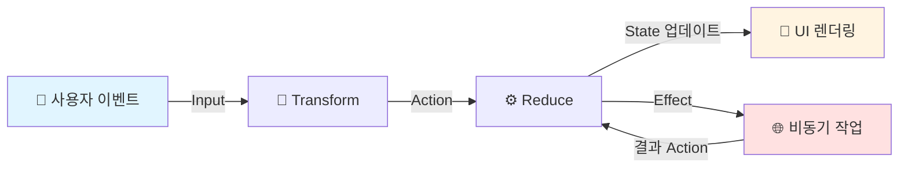
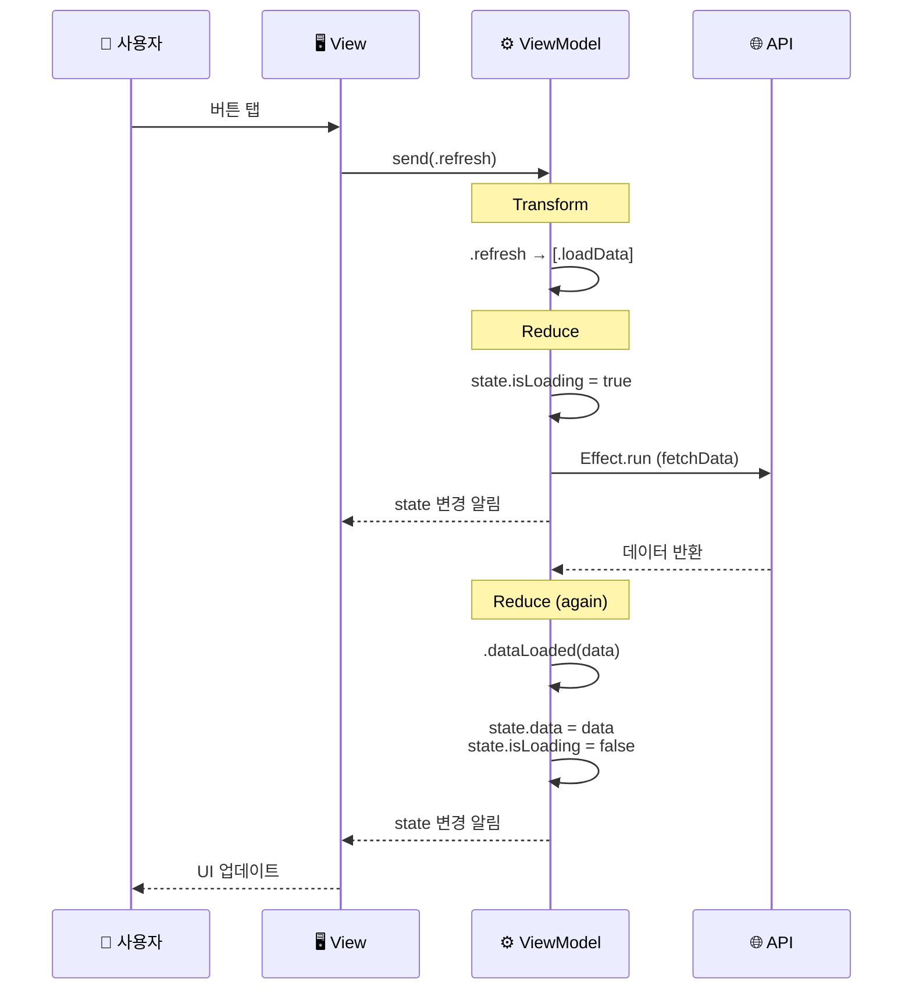
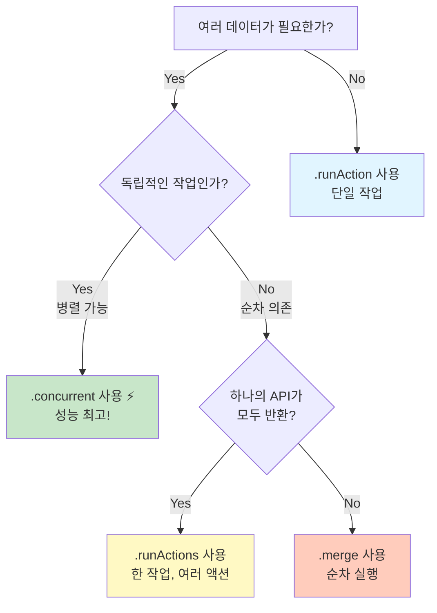

# AsyncViewModel 📱

> Swift 동시성을 활용한 단방향 데이터 흐름 ViewModel 프레임워크

[](https://swift.org)
[](https://swift.org)
[](LICENSE)

## 목차

- [소개](#소개)
- [핵심 개념](#핵심-개념)
- [설치](#설치)
- [빠른 시작](#빠른-시작)
- [상세 가이드](#상세-가이드)
- [Effect 완벽 가이드](#effect-완벽-가이드)
  - [`.run` vs `.runAction`](#3-run-vs-runaction---뭐가-다른가요-)
  - [`.concurrent` vs `.runActions`](#4-concurrent-vs-runactions---헷갈리지-마세요-)
  - [AsyncEffect 편의 메서드](#5-asynceffect-편의-메서드-완벽-가이드-)
- [에러 처리](#에러-처리)
- [테스트](#테스트)
- [예제](#예제)
- [FAQ](#faq)

---

## 소개

### AsyncViewModel이 뭔가요? 🤔

여러분이 **레스토랑 주방장**이라고 상상해보세요. 손님의 주문(Input)을 받으면:

1. **주문서를 확인**하고 (Transform)
2. **요리 단계를 결정**하고 (Action)
3. **재료 상태를 업데이트**하며 (State)
4. **비동기 작업**(불 켜기, 오븐 예열)을 시작합니다 (Effect)

AsyncViewModel은 이런 복잡한 흐름을 **체계적이고 예측 가능하게** 관리하는 도구입니다!

### 왜 AsyncViewModel을 사용하나요? 💡

#### ❌ 기존 방식의 문제점

```swift
class MessyViewModel: ObservableObject {
    @Published var user: User?
    @Published var posts: [Post] = []
    @Published var isLoading = false
    
    func loadData() {
        isLoading = true
        
        // 😱 콜백 지옥
        userService.fetchUser { [weak self] user in
            self?.user = user
            
            postService.fetchPosts { posts in
                self?.posts = posts
                self?.isLoading = false
            }
        }
    }
    
    // 🤯 상태가 여기저기 흩어져 있음
    // 🐛 버그 추적이 어려움
    // 🔄 데이터 흐름을 예측하기 힘듦
}
```

#### ✅ AsyncViewModel 방식

```swift
class CleanViewModel: AsyncViewModel {
    // 모든 상태가 한 곳에!
    struct State: Equatable {
        var user: User?
        var posts: [Post] = []
        var isLoading = false
    }
    
    // 명확한 액션!
    enum Action: Equatable {
        case loadData
        case userLoaded(User)
        case postsLoaded([Post])
    }
    
    // 예측 가능한 상태 변경!
    func reduce(state: inout State, action: Action) -> [AsyncEffect<Action, CancelID>] {
        switch action {
        case .loadData:
            state.isLoading = true
            return [
                .runAction { try await userService.fetchUser() }
                    .map { .userLoaded($0) },
                .runAction { try await postService.fetchPosts() }
                    .map { .postsLoaded($0) }
            ]
        case let .userLoaded(user):
            state.user = user
            return []
        case let .postsLoaded(posts):
            state.posts = posts
            state.isLoading = false
            return []
        }
    }
}
```

---

## 핵심 개념

### 단방향 데이터 흐름 (Unidirectional Data Flow)

AsyncViewModel은 **단방향**으로만 데이터가 흐릅니다. 마치 **강물**처럼요! 🌊



### 4가지 핵심 타입

#### 1. **Input** - 사용자의 의도

```swift
enum Input {
    case viewDidLoad           // 화면이 나타남
    case buttonTapped          // 버튼을 탭함
    case textChanged(String)   // 텍스트가 변경됨
}
```

**비유**: 레스토랑의 주문서 📋

#### 2. **Action** - 구체적인 작업

```swift
enum Action: Equatable {
    case loadingStarted
    case dataLoaded(Data)
    case errorOccurred(String)
}
```

**비유**: 주방의 작업 지시서 📝

#### 3. **State** - 앱의 현재 상태

```swift
struct State: Equatable {
    var isLoading = false
    var data: [Item] = []
    var errorMessage: String?
}
```

**비유**: 주방의 재료 상태판 📊

#### 4. **Effect** - 부수 효과 (비동기 작업)

```swift
enum AsyncEffect<Action, CancelID> {
    case none                  // 아무것도 안 함
    case action(Action)        // 다른 액션 실행
    case run(operation)        // 비동기 작업
    case cancel(id)           // 작업 취소
    case merge([Effect])      // 순차 실행
    case concurrent([Effect]) // 병렬 실행
}
```

**비유**: 주방의 비동기 작업들 (오븐, 냉장고, 배달) 🔥

---

## 설치

### Swift Package Manager

```swift
dependencies: [
    .package(url: "https://github.com/yourusername/AsyncViewModel.git", from: "1.0.0")
]
```

또는 Xcode에서:
1. File → Add Package Dependencies...
2. URL 입력
3. Add Package

### Tuist 프로젝트

이 프로젝트는 Tuist를 사용하여 완전히 모듈화되어 있습니다.

```bash
# 1. Tuist 설치 (최초 1회)
curl -Ls https://install.tuist.io | bash

# 2. 프로젝트 설정
make setup

# 또는 수동으로:
tuist install   # 외부 의존성 설치
tuist generate  # Xcode 프로젝트 생성
open AsyncViewModel.xcworkspace
```

**주요 명령어**:
- `make setup` - 최초 설정 (의존성 설치 + 프로젝트 생성)
- `make generate` - 프로젝트 생성
- `make build` - 빌드
- `make test` - 테스트 실행
- `make clean` - 정리
- `make graph` - 의존성 그래프 시각화

**자세한 내용**: [Tuist 프로젝트 가이드](README-TUIST.md)

---

## 빠른 시작

### Step 1: ViewModel 정의하기

```swift
import AsyncViewModel

@MainActor
final class CounterViewModel: AsyncViewModel {
    // 1️⃣ 타입 정의
    enum Input {
        case increment
        case decrement
        case reset
    }
    
    enum Action: Equatable, Sendable {
        case increment
        case decrement  
        case reset
    }
    
    struct State: Equatable, Sendable {
        var count: Int = 0
    }
    
    enum CancelID: Hashable {
        case none
    }
    
    // 2️⃣ 필수 프로퍼티
    @Published var state: State
    var tasks: [CancelID: Task<Void, Never>] = [:]
    var effectQueue: [AsyncEffect<Action, CancelID>] = []
    var isProcessingEffects = false
    var actionObserver: ((Action) -> Void)?
    
    init(initialState: State = State()) {
        self.state = initialState
    }
    
    // 3️⃣ Transform: Input → Action
    func transform(_ input: Input) -> [Action] {
        switch input {
        case .increment: return [.increment]
        case .decrement: return [.decrement]
        case .reset: return [.reset]
        }
    }
    
    // 4️⃣ Reduce: Action → State + Effect
    func reduce(state: inout State, action: Action) -> [AsyncEffect<Action, CancelID>] {
        switch action {
        case .increment:
            state.count += 1
            return []
            
        case .decrement:
            state.count -= 1
            return []
            
        case .reset:
            state.count = 0
            return []
        }
    }
}
```

### Step 2: SwiftUI View에서 사용하기

```swift
struct CounterView: View {
    @StateObject private var viewModel = CounterViewModel()
    
    var body: some View {
        VStack(spacing: 20) {
            Text("Count: \(viewModel.state.count)")
                .font(.largeTitle)
            
            HStack {
                Button("−") { viewModel.send(.decrement) }
                Button("Reset") { viewModel.send(.reset) }
                Button("+") { viewModel.send(.increment) }
            }
        }
    }
}
```

---

## 상세 가이드

### Transform vs Reduce

많은 분들이 헷갈려하는 부분입니다. 차이를 명확히 알아볼까요?

#### Transform: 입력의 "번역기" 🔤

```swift
func transform(_ input: Input) -> [Action] {
    // ✅ 할 일: Input을 Action으로 변환
    // ❌ 하면 안 되는 것: 상태 변경, 비동기 작업
    
    switch input {
    case .buttonTapped:
        // 버튼 탭 → 여러 액션으로 변환 가능
        return [.trackAnalytics, .loadData]
        
    case let .textChanged(text):
        // 조건에 따라 다른 액션
        if text.isEmpty {
            return [.clearSearch]
        } else {
            return [.search(text)]
        }
    }
}
```

**언제 사용하나요?**
- 하나의 입력을 여러 액션으로 분해
- 입력 이벤트를 도메인 액션으로 변환
- 조건부 액션 생성

#### Reduce: 상태의 "요리사" 👨‍🍳

```swift
func reduce(state: inout State, action: Action) -> [AsyncEffect<Action, CancelID>] {
    // ✅ 할 일: 상태 변경, Effect 반환
    // ❌ 하면 안 되는 것: 직접 비동기 작업 실행
    
    switch action {
    case .loadData:
        state.isLoading = true
        // Effect를 반환 (실행은 X)
        return [
            .runAction { try await api.fetchData() }
        ]
        
    case let .dataLoaded(data):
        state.isLoading = false
        state.data = data
        return []  // 추가 작업 없음
        
    case let .error(message):
        state.isLoading = false
        state.error = message
        return []
    }
}
```

**핵심 원칙**:
- ✅ **순수 함수**: 같은 입력 → 같은 결과
- ✅ **동기적**: 즉시 실행되고 반환
- ✅ **예측 가능**: 테스트하기 쉬움

### 데이터 흐름의 실제 예제

사용자가 "새로고침" 버튼을 눌렀을 때의 전체 흐름:



---

## Effect 완벽 가이드

Effect는 AsyncViewModel의 **마법** ✨입니다. 비동기 작업을 우아하게 다루는 방법을 배워봅시다.

### 1. 기본 Effect들

#### `.none` - 아무것도 안 하기

```swift
func reduce(state: inout State, action: Action) -> [AsyncEffect<Action, CancelID>] {
    switch action {
    case .justUpdateUI:
        state.message = "완료!"
        return []  // 또는 [.none]
    }
}
```

**언제 사용?** 상태만 변경하고 추가 작업이 필요 없을 때

#### `.action` - 다른 액션 실행하기

```swift
case .loginSuccess:
    state.isLoggedIn = true
    // 로그인 후 자동으로 데이터 로드
    return [.action(.loadUserData)]
```

**언제 사용?** 하나의 액션이 다른 액션을 트리거할 때

#### `.run` - 비동기 작업 실행하기

```swift
case .loadData:
    state.isLoading = true
    return [
        .runAction(id: .dataFetch) {
            try await api.fetchData()
        }
    ]
```

**언제 사용?** 네트워크 요청, 파일 I/O, 데이터베이스 작업 등

### 2. 고급 Effect들

#### `.merge` - 순차 실행 🔄

여러 작업을 **차례대로** 실행합니다.

```swift
case .orderFood:
    return [
        .action(.checkPayment),      // 1️⃣ 먼저
        .action(.prepareIngredients), // 2️⃣ 그 다음
        .action(.startCooking)        // 3️⃣ 마지막
    ]
```

**비유**: 요리 순서 - 재료 확인 → 손질 → 조리

#### `.concurrent` - 병렬 실행 ⚡

여러 작업을 **동시에** 실행합니다.

```swift
case .loadDashboard:
    state.isLoading = true
    return .concurrent([
        .runAction { try await api.fetchUser() }
            .map { .userLoaded($0) },
        .runAction { try await api.fetchPosts() }
            .map { .postsLoaded($0) },
        .runAction { try await api.fetchComments() }
            .map { .commentsLoaded($0) }
    ])
```

**성능 비교**:
```
순차 실행: 500ms + 300ms + 200ms = 1000ms
병렬 실행: max(500ms, 300ms, 200ms) = 500ms ⚡
```

**비유**: 여러 요리를 동시에 준비하기 (오븐, 가스레인지, 에어프라이어)

#### `.cancel` - 작업 취소하기

```swift
enum CancelID: Hashable {
    case search
    case autoSave
}

case .searchTextChanged(let text):
    // 이전 검색 취소
    return [
        .cancel(id: .search),
        .debounce(
            id: .search,
            for: 0.3  // 300ms 대기
        ) {
            try await searchAPI.search(text)
        }
    ]
```

**언제 사용?** 검색, 자동 저장, 무한 스크롤 등

### 3. `.run` vs `.runAction` - 뭐가 다른가요? 🤔

많은 분들이 헷갈려하는 부분입니다. 명확히 정리해볼까요?

#### 핵심 차이점

**`.run`** = **기본 케이스** (enum case) - 수동 기어 🏎️  
**`.runAction`** = **편의 메서드** (syntactic sugar) - 자동 기어 🚗

```swift
// .run - enum case 정의
case run(id: CancelID? = nil, operation: AsyncOperation<Action>)

// .runAction - 편의 메서드
static func runAction(
    id: CancelID? = nil,
    operation: @escaping @Sendable () async throws -> Action
) -> AsyncEffect<Action, CancelID>
```

#### 비교 예시

**❌ `.run` 사용 - 복잡함 (직접 제어)**
```swift
case .loadProfile:
    return [
        .run(id: .loadProfile, operation: AsyncOperation {
            do {
                let profile = try await profileAPI.fetch()
                return .action(.profileLoaded(profile))  // ✋ 수동 래핑
            } catch {
                return .error(SendableError(error))  // ✋ 에러 처리 직접
            }
        })
    ]
```

**✅ `.runAction` 사용 - 간결함 (자동 처리)**
```swift
case .loadProfile:
    return [
        .runAction(id: .loadProfile) {
            try await profileAPI.fetch()  // 🎉 Action 바로 반환!
        }
        // 에러는 자동으로 handleError() 호출
    ]
```

**코드 라인 수**: 9줄 → 5줄 (44% 감소!) 📉

#### `.runAction`의 내부 구현

```swift
static func runAction(
    id: CancelID? = nil,
    operation: @escaping @Sendable () async throws -> Action
) -> AsyncEffect<Action, CancelID> {
    // 내부적으로 .run을 호출!
    return .run(id: id, operation: AsyncOperation { 
        do {
            let action = try await operation()
            return .action(action)  // ✅ 자동 래핑
        } catch {
            return .error(SendableError(error))  // ✅ 자동 에러 처리
        }
    })
}
```

#### 언제 무엇을 사용할까?

| 상황 | 권장 | 이유 |
|------|------|------|
| 일반 네트워크 요청 | `.runAction` | 간결하고 충분함 |
| 파일 I/O | `.runAction` | 에러 처리 자동 |
| 여러 액션 반환 | `.run` + `.actions([])` | 복잡한 로직 필요 |
| 조건부 액션 | `.run` + `.none` | 선택적 반환 |
| 진행 상황 추적 | `.run` | 중간 액션 발행 |

#### ✅ `.runAction` 사용 케이스 (권장 - 90%)

```swift
// 1. 단순 API 호출
case .loadUser:
    return [.runAction { try await userAPI.fetch() }]

// 2. 데이터베이스 쿼리
case .saveData:
    return [.runAction { try await database.save(data) }]

// 3. 파일 읽기
case .loadFile:
    return [.runAction { try await fileManager.read(path) }]
```

#### ⚠️ `.run` 사용 케이스 (고급 - 10%)

**1. 여러 액션 반환**
```swift
case .complexOperation:
    return [
        .run(id: .complex, operation: AsyncOperation {
            do {
                let result = try await complexAPI.execute()
                
                if result.needsMoreActions {
                    return .actions([.action1, .action2, .action3])  // 여러 개!
                } else {
                    return .action(.completed)
                }
            } catch {
                return .error(SendableError(error))
            }
        })
    ]
```

**2. 조건부 액션**
```swift
case .checkAndLoad:
    return [
        .run(operation: AsyncOperation {
            let hasPermission = await checkPermission()
            
            if hasPermission {
                let data = try await fetchData()
                return .action(.dataLoaded(data))
            } else {
                return .none  // ✅ 액션을 반환하지 않을 수도!
            }
        })
    ]
```

**3. 진행률 추적**
```swift
case .downloadFile:
    return [
        .run(id: .download, operation: AsyncOperation {
            // 다운로드 중 여러 번 액션 발행
            return .actions([
                .downloadProgress(0.25),
                .downloadProgress(0.5),
                .downloadProgress(0.75),
                .downloadCompleted
            ])
        })
    ]
```

#### 📊 빠른 참조표

| 특징 | `.run` | `.runAction` |
|------|--------|--------------|
| 타입 | enum case | 편의 메서드 |
| 복잡도 | 높음 ⭐⭐⭐ | 낮음 ⭐ |
| 제어력 | 완전 제어 | 제한적 |
| 에러 처리 | 수동 🔧 | 자동 ✨ |
| 반환 타입 | `AsyncOperationResult` | `Action` |
| 코드 길이 | 길음 📜 | 짧음 📝 |
| 사용 빈도 | 10% | 90% 🎯 |

#### 💡 기억하기 쉬운 방법

```
.runAction = "액션만 만들어줘" (간단) 🎯
.run = "내가 모든 걸 직접 제어할래" (복잡) 🔧
```

**결론**: 99%의 경우 `.runAction`을 사용하면 충분합니다! 😊

### 4. `.concurrent` vs `.runActions` - 헷갈리지 마세요! 🤔

이 둘은 **"여러 개"** 라는 공통점 때문에 혼동되지만, **완전히 다른 차원**의 개념입니다!

#### 핵심 차이점

```
.concurrent  → 여러 Effect를 병렬로 실행 (🏃🏃🏃 여러 사람이 동시에 달림)
.runActions  → 하나의 작업에서 여러 액션 반환 (📦 한 택배에 여러 물건)
```

#### 레벨의 차이

**`.concurrent` - Effect 레벨의 병렬성**
```swift
// 여러 개의 독립적인 비동기 작업을 동시에 실행
return .concurrent([
    .runAction { try await userAPI.fetch() },      // 작업 1 ⚡
    .runAction { try await postsAPI.fetch() },     // 작업 2 ⚡
    .runAction { try await commentsAPI.fetch() }   // 작업 3 ⚡
])
// 🏃🏃🏃 세 명의 주자가 동시에 달림
// 실행 시간: max(500ms, 300ms, 200ms) = 500ms
```

**`.runActions` - Action 레벨의 다중 반환**
```swift
// 하나의 비동기 작업에서 여러 액션을 순차적으로 반환
return [
    .runActions {
        let user = try await userAPI.fetch()       // 500ms
        let posts = try await postsAPI.fetch()     // 300ms
        
        return [
            .userLoaded(user),      // 액션 1
            .postsLoaded(posts),    // 액션 2
            .dashboardReady         // 액션 3
        ]
    }
]
// 📦 한 명의 주자가 여러 물건을 한꺼번에 배달
// 실행 시간: 500ms + 300ms = 800ms
```

#### 비교표

| 측면 | `.concurrent` | `.runActions` |
|------|---------------|---------------|
| **레벨** | Effect 레벨 | Action 레벨 |
| **목적** | 여러 작업 병렬 실행 | 여러 액션 반환 |
| **실행 방식** | 동시 실행 ⚡ | 순차 실행 🔄 |
| **작업 개수** | 여러 개 | 1개 |
| **액션 개수** | 각 작업당 1개씩 | 여러 개 |
| **성능** | 빠름 | 보통 |
| **사용 빈도** | 30% | 5% |

#### 실전 예제: 대시보드 로딩

**✅ `.concurrent` (권장)**
```swift
case .loadDashboard:
    state.isLoading = true
    
    // 3개의 API를 동시에 호출
    return .concurrent([
        .runAction(id: .fetchUser) {
            try await userAPI.fetch()
        }.map { .userLoaded($0) },
        
        .runAction(id: .fetchPosts) {
            try await postsAPI.fetch()
        }.map { .postsLoaded($0) },
        
        .runAction(id: .fetchComments) {
            try await commentsAPI.fetch()
        }.map { .commentsLoaded($0) }
    ])
    
// ⚡ 500ms (병렬)
// 각 API가 완료되면 즉시 UI 업데이트!
```

**⚠️ `.runActions` (특수 케이스)**
```swift
case .loadDashboard:
    state.isLoading = true
    
    return [
        .runActions(id: .fetchAll) {
            // 순차적으로 실행
            let user = try await userAPI.fetch()
            let posts = try await postsAPI.fetch()
            let comments = try await commentsAPI.fetch()
            
            return [
                .userLoaded(user),
                .postsLoaded(posts),
                .commentsLoaded(comments)
            ]
        }
    ]
    
// 🐢 1000ms (순차)
// 모든 API가 완료되어야 UI 업데이트 시작
```

**성능 차이**: 500ms vs 1000ms (2배!) 📉

#### 결정 플로우차트



#### 언제 무엇을 사용할까?

**✅ `.concurrent` 사용하세요 (90%)**
- 독립적인 여러 API 호출
- 빠른 성능이 필요할 때
- 점진적 UI 업데이트를 원할 때
- 하나 실패해도 나머지는 계속해야 할 때

**⚠️ `.runActions` 사용하세요 (10%)**
- 하나의 API가 여러 데이터를 반환할 때
- 순차적 의존 관계가 있을 때
- 원자적 처리가 필요할 때 (all or nothing)

#### 비유로 이해하기

**`.concurrent` = 여러 배달원 🏃🏃🏃**
```swift
.concurrent([
    .runAction { await 배달원A.피자배달() },    // 30분
    .runAction { await 배달원B.치킨배달() },    // 20분
    .runAction { await 배달원C.음료배달() }     // 10분
])
// 총 시간: 30분 (가장 느린 배달원 기준)
// 각 배달원이 도착하면 즉시 전달!
```

**`.runActions` = 한 배달원 📦**
```swift
.runActions {
    let 피자 = await 식당.피자준비()    // 20분
    let 음료 = await 편의점.음료준비()   // 5분
    return [.피자도착(피자), .음료도착(음료)]
}
// 총 시간: 25분
// 모든 물건이 준비되어야 출발, 한꺼번에 도착
```

#### 💡 기억하기

```
.concurrent([A, B, C])  = 🏃 🏃 🏃  (여러 작업 동시 실행)
.runActions { [A, B, C] } = 📦 (한 작업, 여러 액션)
```

**결론**: **독립적인 작업이 여러 개**면 무조건 `.concurrent`! 성능이 2배 이상 빠릅니다! ⚡

### 5. AsyncEffect 편의 메서드 완벽 가이드 📚

AsyncEffect는 다양한 편의 메서드를 제공하여 일반적인 패턴을 쉽게 구현할 수 있습니다.

#### 5.1 기본 편의 메서드

##### `.runAction()` - 단일 액션 반환 🎯

가장 많이 사용하는 편의 메서드입니다!

```swift
static func runAction(
    id: CancelID? = nil,
    operation: @escaping @Sendable () async throws -> Action
) -> AsyncEffect<Action, CancelID>
```

**사용 예시**:
```swift
case .loadUser:
    return [
        .runAction(id: .fetchUser) {
            try await userAPI.fetch()
        }
    ]
```

**특징**:
- ✅ 단일 액션 반환
- ✅ 자동 에러 처리 (`handleError` 호출)
- ✅ 간결한 문법

##### `.runActions()` - 여러 액션 반환 📦

하나의 작업에서 여러 액션을 순차적으로 발행합니다.

```swift
static func runActions(
    id: CancelID? = nil,
    operation: @escaping @Sendable () async throws -> [Action]
) -> AsyncEffect<Action, CancelID>
```

**사용 예시**:
```swift
case .loadDashboard:
    return [
        .runActions {
            let user = try await userAPI.fetch()
            let settings = try await settingsAPI.fetch()
            
            // 여러 액션을 한 번에 반환
            return [
                .userLoaded(user),
                .settingsLoaded(settings),
                .dashboardReady
            ]
        }
    ]
```

**언제 사용?**:
- 관련된 여러 작업의 결과를 한 번에 처리
- 순차적인 액션 발행이 필요할 때

##### 순차 실행 - 배열 사용 🔗

여러 Effect를 간편하게 순차 실행합니다.

**순차 실행 방법**:
```swift
return [
    .action(.step1),
    .action(.step2),
    .action(.step3)
]
```

##### `.concurrent()` - 가변 인자 버전 ⚡

여러 Effect를 간편하게 병렬 실행합니다.

```swift
static func concurrent(_ effects: AsyncEffect<Action, CancelID>...) -> AsyncEffect<Action, CancelID>
```

**Before (배열 사용)**:
```swift
return .concurrent([
    .runAction { try await fetchA() },
    .runAction { try await fetchB() },
    .runAction { try await fetchC() }
])
```

**After (가변 인자)**:
```swift
return .concurrent(
    .runAction { try await fetchA() },
    .runAction { try await fetchB() },
    .runAction { try await fetchC() }
)
```

#### 5.2 에러 처리 편의 메서드 🛡️

##### `.runCatchingError()` - 에러를 액션으로 변환 (단일)

에러를 상태의 일부로 관리하고 싶을 때 사용합니다!

```swift
static func runCatchingError(
    id: CancelID? = nil,
    errorAction: @escaping @Sendable (SendableError) -> Action,
    operation: @escaping @Sendable () async throws -> Action
) -> AsyncEffect<Action, CancelID>
```

**사용 예시**:
```swift
case .loadData:
    state.isLoading = true
    return [
        .runCatchingError(
            id: .dataLoad,
            errorAction: { error in
                .loadFailed(error.localizedDescription)
            }
        ) {
            let data = try await api.fetchData()
            return .dataLoaded(data)
        }
    ]

case let .loadFailed(message):
    state.isLoading = false
    state.errorMessage = message
    state.showError = true
    return []
```

**장점**:
- ✅ 에러가 상태의 일부가 됨
- ✅ UI에서 에러를 표시하기 쉬움
- ✅ 테스트하기 쉬움
- ✅ 시간 여행 디버깅 가능

**vs 기본 에러 처리**:
```swift
// ❌ 기본 방식: 에러가 로그로만 출력됨
.runAction {
    try await api.fetch()
}

// ✅ runCatchingError: 에러도 액션으로 관리
.runCatchingError(errorAction: { .apiFailed($0) }) {
    try await api.fetch()
}
```

##### `.runActionsCatchingError()` - 에러를 액션으로 변환 (여러 개)

여러 액션을 반환하면서 에러도 관리합니다.

```swift
static func runActionsCatchingError(
    id: CancelID? = nil,
    errorAction: @escaping @Sendable (SendableError) -> [Action],
    operation: @escaping @Sendable () async throws -> [Action]
) -> AsyncEffect<Action, CancelID>
```

**사용 예시**:
```swift
case .loadAllData:
    return [
        .runActionsCatchingError(
            errorAction: { error in
                // 에러 발생 시 여러 정리 액션 실행
                [
                    .showError(error.localizedDescription),
                    .resetLoadingState,
                    .trackError(error)
                ]
            }
        ) {
            let user = try await userAPI.fetch()
            let posts = try await postsAPI.fetch()
            
            return [
                .userLoaded(user),
                .postsLoaded(posts),
                .allDataLoaded
            ]
        }
    ]
```

#### 5.3 시간 기반 편의 메서드 ⏰

##### `.sleep()` - 단순 대기

지정된 시간만큼 대기만 합니다.

```swift
static func sleep(
    id: CancelID? = nil,
    for duration: TimeInterval
) -> AsyncEffect<Action, CancelID>
```

**사용 예시**:
```swift
case .showNotification:
    state.showNotification = true
    return [
        .sleep(for: 3.0),  // 3초 대기
        .action(.hideNotification)
    ]
```

##### `.sleepThen()` - 대기 후 액션 실행

대기 후 특정 액션을 실행합니다.

```swift
static func sleepThen(
    id: CancelID? = nil,
    for duration: TimeInterval,
    action: Action
) -> AsyncEffect<Action, CancelID>
```

**사용 예시**:
```swift
case .startCountdown:
    state.countdown = 3
    return [
        .sleepThen(for: 1.0, action: .decrementCountdown),
        // 1초 후 자동으로 .decrementCountdown 실행
    ]
```

**vs `.sleep()` + `.action()`**:
```swift
// Before
return [
    .sleep(for: 1.0),
    .action(.doSomething)
]

// After (더 명확)
return [
    .sleepThen(for: 1.0, action: .doSomething)
]
```

##### `.debounce()` - 디바운스 ⏱️

연속된 호출에서 마지막 호출만 실행합니다.

```swift
static func debounce(
    id: CancelID,
    for duration: TimeInterval,
    operation: @escaping @Sendable () async throws -> Action
) -> AsyncEffect<Action, CancelID>
```

**사용 예시**:
```swift
case let .searchTextChanged(query):
    state.query = query
    return [
        .cancel(id: .search),  // 이전 검색 취소
        .debounce(id: .search, for: 0.5) {
            try await searchAPI.search(query)
        }
    ]
```

**동작 방식**:
```
시간 →
0ms:   사용자가 'a' 입력 → debounce 시작
100ms: 사용자가 'b' 입력 → 이전 취소, 새로 시작
200ms: 사용자가 'c' 입력 → 이전 취소, 새로 시작
700ms: (500ms 경과) → 검색 실행! "abc"
```

**언제 사용?**:
- 🔍 검색 입력
- 💾 자동 저장
- 📝 실시간 유효성 검사

##### `.throttle()` - 스로틀 🚦

일정 시간 간격으로만 실행을 허용합니다.

```swift
static func throttle(
    id: CancelID,
    interval: TimeInterval,
    operation: @escaping @Sendable () async throws -> Action
) -> AsyncEffect<Action, CancelID>
```

**사용 예시**:
```swift
case .scrollPositionChanged:
    return [
        .cancel(id: .trackScroll),
        .throttle(id: .trackScroll, interval: 0.5) {
            try await analytics.trackScroll()
        }
    ]
```

**debounce vs throttle 비교**:

```
Debounce (마지막 입력 후 실행):
입력: •••••••••••••••••
실행:                  ✓ (마지막 하나만)

Throttle (일정 간격으로 실행):
입력: •••••••••••••••••
실행: ✓      ✓      ✓   (간격마다)
```

**언제 사용?**:
- 📊 스크롤 이벤트 추적
- 🎮 버튼 연타 방지
- 📈 실시간 차트 업데이트

#### 5.4 편의 메서드 치트 시트 📋

| 메서드 | 용도 | 에러 처리 | 반환 |
|--------|------|-----------|------|
| `.runAction()` | 일반 비동기 작업 | 자동 | 단일 액션 |
| `.runActions()` | 여러 결과 반환 | 자동 | 여러 액션 |
| `.runCatchingError()` | 에러도 상태로 관리 | 액션 변환 | 단일 액션 |
| `.runActionsCatchingError()` | 에러도 상태로 관리 | 액션 변환 | 여러 액션 |
| `.sleep()` | 단순 대기 | - | 없음 |
| `.sleepThen()` | 대기 후 액션 | - | 단일 액션 |
| `.debounce()` | 입력 완료 대기 | 자동 | 단일 액션 |
| `.throttle()` | 호출 빈도 제한 | 자동 | 단일 액션 |
| 순차 실행 | 배열 사용 | - | 복합 |
| `.concurrent()` | 병렬 실행 (가변 인자) | - | 복합 |

#### 5.5 실전 조합 예시 🎨

##### 검색 + Debounce + 에러 처리

```swift
case let .searchQueryChanged(query):
    state.searchQuery = query
    
    guard !query.isEmpty else {
        state.searchResults = []
        return [.cancel(id: .search)]
    }
    
    state.isSearching = true
    return [
        .cancel(id: .search),
        .debounce(id: .search, for: 0.3) {
            try await searchService.search(query)
        }
        // 에러는 자동으로 handleError 호출
    ]
```

##### 로딩 + 타임아웃 + 에러 처리

```swift
case .loadDataWithTimeout:
    state.isLoading = true
    return .concurrent(
        // 실제 데이터 로드
        .runCatchingError(
            id: .dataLoad,
            errorAction: { .loadFailed($0) }
        ) {
            try await api.fetchData()
        },
        // 타임아웃 처리
        .sleepThen(for: 10.0, action: .loadTimeout)
    )

case .loadTimeout:
    return [
        .cancel(id: .dataLoad),
        .action(.showTimeoutError)
    ]
```

##### 자동 저장 + Debounce

```swift
case let .contentChanged(content):
    state.content = content
    state.hasUnsavedChanges = true
    
    return [
        .cancel(id: .autoSave),
        .debounce(id: .autoSave, for: 2.0) {
            try await storage.save(content)
        }
    ]

case .contentSaved:
    state.hasUnsavedChanges = false
    state.showSavedIndicator = true
    return [
        .sleepThen(for: 3.0, action: .hideSavedIndicator)
    ]
```

##### 무한 스크롤 + Throttle

```swift
case .scrolledNearBottom:
    guard !state.isLoadingMore && state.hasMore else {
        return []
    }
    
    return [
        .throttle(id: .loadMore, interval: 1.0) {
            try await feedAPI.loadNextPage()
        }
    ]
```

#### 5.6 성능 최적화 팁 ⚡

1. **ID 사용으로 중복 실행 방지**
   ```swift
   // ✅ 같은 ID로 이전 작업 자동 취소
   .runAction(id: .fetch) { ... }
   
   // ❌ ID 없으면 중복 실행 가능
   .runAction { ... }
   ```

2. **적절한 타임아웃 설정**
   ```swift
   // ✅ 적절한 debounce 시간
   .debounce(for: 0.3)  // 검색
   .debounce(for: 2.0)  // 자동 저장
   
   // ❌ 너무 짧거나 긺
   .debounce(for: 0.01)  // 너무 빠름
   .debounce(for: 10.0)  // 너무 느림
   ```

3. **병렬 실행 활용**
   ```swift
   // ✅ 독립적인 작업은 병렬로
   return .concurrent(
       .runAction { try await fetchUser() },
       .runAction { try await fetchPosts() },
       .runAction { try await fetchComments() }
   )
   ```

---

## 에러 처리

AsyncViewModel은 에러를 처리하는 두 가지 방식을 제공합니다.

### 기본 방식 - `handleError` 자동 호출

가장 간단한 방법입니다. 에러가 발생하면 자동으로 `handleError(_:)` 메서드가 호출됩니다.

```swift
case .loadData:
    return [
        .runAction {
            try await api.fetchData()
        }
        // 에러 발생 시 자동으로 handleError(_:) 호출
    ]

// handleError 기본 구현은 로그만 출력
func handleError(_ error: SendableError) {
    // 기본적으로 os.log로 로깅됨
}
```

**장점**: 간단하고 빠름  
**단점**: UI에 에러 표시 불가, 테스트 어려움

### 권장 방식 - 에러를 Action으로 변환

**`.runCatchingError()`** 사용으로 에러를 상태의 일부로 관리합니다!

```swift
case .loadData:
    state.isLoading = true
    return [
        .runCatchingError(
            errorAction: { error in .loadFailed(error.localizedDescription) }
        ) {
            let data = try await api.fetchData()
            return .dataLoaded(data)
        }
    ]
    
case let .loadFailed(message):
    state.isLoading = false
    state.errorMessage = message
    state.showError = true
    return []
```

**장점**:
- ✅ 에러가 상태의 일부가 됨
- ✅ UI에서 에러 표시 가능
- ✅ 테스트하기 쉬움
- ✅ 시간 여행 디버깅 가능

> 💡 **팁**: 프로덕션 앱에서는 항상 `.runCatchingError()`를 사용하세요!

---

## 테스트

AsyncViewModel은 테스트하기 정말 쉽습니다! 🧪

### AsyncTestStore 사용하기

```swift
import Testing
import AsyncViewModel

@MainActor
@Test("카운터 증가 테스트")
func testIncrement() async throws {
    // Given - 준비
    let viewModel = CounterViewModel()
    let store = AsyncTestStore(viewModel: viewModel)
    defer { store.cleanup() }  // 정리
    
    // When - 실행
    store.send(.increment)
    
    // Then - 검증
    #expect(store.state.count == 1)
    #expect(store.actions == [.increment])
}

@Test("비동기 데이터 로드 테스트")
func testLoadData() async throws {
    // Given
    let viewModel = DataViewModel()
    let store = AsyncTestStore(viewModel: viewModel)
    defer { store.cleanup() }
    
    // When
    store.send(.loadData)
    
    // 모든 Effect가 완료될 때까지 대기
    try await store.waitForEffects(timeout: 1.0)
    
    // Then
    #expect(store.state.isLoading == false)
    #expect(store.state.data.isEmpty == false)
}

@Test("상태 변화 대기 테스트")
func testStateChange() async throws {
    let store = AsyncTestStore(viewModel: viewModel)
    defer { store.cleanup() }
    
    store.send(.loadData)
    
    // 특정 조건이 될 때까지 대기
    try await store.wait(for: { state in
        state.data.count > 0
    }, timeout: 2.0)
    
    #expect(store.state.data.count > 0)
}
```

### 테스트 팁 💡

1. **모든 액션 추적**
   ```swift
   // AsyncTestStore가 자동으로 모든 액션을 기록합니다
   #expect(store.actions == [
       .loadData,
       .loadingStarted,
       .dataLoaded(mockData)
   ])
   ```

2. **Effect 대기**
   ```swift
   try await store.waitForEffects()  // 모든 비동기 작업 완료 대기
   ```

3. **상태 스냅샷**
   ```swift
   let stateBefore = store.state
   store.send(.someAction)
   let stateAfter = store.state
   
   #expect(stateBefore != stateAfter)
   ```

---

## 예제

### 실전 예제 1: 검색 기능 🔍

```swift
@MainActor
final class SearchViewModel: AsyncViewModel {
    struct State: Equatable, Sendable {
        var query: String = ""
        var results: [SearchResult] = []
        var isSearching = false
    }
    
    enum Input {
        case searchTextChanged(String)
        case searchCancelled
    }
    
    enum Action: Equatable, Sendable {
        case updateQuery(String)
        case startSearch(String)
        case searchResultsReceived([SearchResult])
        case cancelSearch
    }
    
    enum CancelID: Hashable {
        case search
    }
    
    // ... 프로퍼티 선언 ...
    
    func transform(_ input: Input) -> [Action] {
        switch input {
        case let .searchTextChanged(text):
            return [.updateQuery(text), .startSearch(text)]
        case .searchCancelled:
            return [.cancelSearch]
        }
    }
    
    func reduce(state: inout State, action: Action) -> [AsyncEffect<Action, CancelID>] {
        switch action {
        case let .updateQuery(query):
            state.query = query
            return []
            
        case let .startSearch(query):
            guard !query.isEmpty else {
                state.results = []
                return []
            }
            
            state.isSearching = true
            
            // 이전 검색 취소 + Debounce
            return [
                .cancel(id: .search),
                .debounce(id: .search, for: 0.3) {
                    try await searchService.search(query)
                }.map { .searchResultsReceived($0) }
            ]
            
        case let .searchResultsReceived(results):
            state.isSearching = false
            state.results = results
            return []
            
        case .cancelSearch:
            state.isSearching = false
            state.results = []
            return [.cancel(id: .search)]
        }
    }
}
```

### 실전 예제 2: 로그인 플로우 🔐

```swift
@MainActor
final class LoginViewModel: AsyncViewModel {
    struct State: Equatable, Sendable {
        var email: String = ""
        var password: String = ""
        var isLoggingIn = false
        var isLoggedIn = false
        var errorMessage: String?
    }
    
    enum Input {
        case emailChanged(String)
        case passwordChanged(String)
        case loginButtonTapped
    }
    
    enum Action: Equatable, Sendable {
        case updateEmail(String)
        case updatePassword(String)
        case login
        case loginSuccess(User)
        case loginFailed(String)
        case loadUserData
        case userDataLoaded(UserData)
    }
    
    enum CancelID: Hashable {
        case login
        case loadUserData
    }
    
    func transform(_ input: Input) -> [Action] {
        switch input {
        case let .emailChanged(email):
            return [.updateEmail(email)]
        case let .passwordChanged(password):
            return [.updatePassword(password)]
        case .loginButtonTapped:
            return [.login]
        }
    }
    
    func reduce(state: inout State, action: Action) -> [AsyncEffect<Action, CancelID>] {
        switch action {
        case let .updateEmail(email):
            state.email = email
            state.errorMessage = nil
            return []
            
        case let .updatePassword(password):
            state.password = password
            state.errorMessage = nil
            return []
            
        case .login:
            state.isLoggingIn = true
            state.errorMessage = nil
            
            return [
                .runCatchingError(
                    id: .login,
                    errorAction: { .loginFailed($0.localizedDescription) }
                ) {
                    try await authService.login(
                        email: state.email,
                        password: state.password
                    )
                }.map { .loginSuccess($0) }
            ]
            
        case let .loginSuccess(user):
            state.isLoggingIn = false
            state.isLoggedIn = true
            // 로그인 성공 후 자동으로 데이터 로드
            return [.action(.loadUserData)]
            
        case let .loginFailed(message):
            state.isLoggingIn = false
            state.errorMessage = message
            return []
            
        case .loadUserData:
            return [
                .runAction(id: .loadUserData) {
                    try await userDataService.fetch()
                }.map { .userDataLoaded($0) }
            ]
            
        case let .userDataLoaded(data):
            // 사용자 데이터 저장
            return []
        }
    }
}
```

### 실전 예제 3: 무한 스크롤 📜

```swift
@MainActor
final class FeedViewModel: AsyncViewModel {
    struct State: Equatable, Sendable {
        var items: [FeedItem] = []
        var page = 0
        var isLoading = false
        var hasMore = true
    }
    
    enum Input {
        case viewDidLoad
        case reachedBottom
        case refresh
    }
    
    enum Action: Equatable, Sendable {
        case loadNextPage
        case itemsLoaded([FeedItem], hasMore: Bool)
        case reset
    }
    
    enum CancelID: Hashable {
        case loadPage
    }
    
    func transform(_ input: Input) -> [Action] {
        switch input {
        case .viewDidLoad:
            return [.loadNextPage]
        case .reachedBottom:
            return [.loadNextPage]
        case .refresh:
            return [.reset, .loadNextPage]
        }
    }
    
    func reduce(state: inout State, action: Action) -> [AsyncEffect<Action, CancelID>] {
        switch action {
        case .loadNextPage:
            guard !state.isLoading && state.hasMore else {
                return []
            }
            
            state.isLoading = true
            let currentPage = state.page
            
            return [
                .runAction(id: .loadPage) {
                    try await feedService.loadPage(currentPage)
                }.map { response in
                    .itemsLoaded(response.items, hasMore: response.hasMore)
                }
            ]
            
        case let .itemsLoaded(items, hasMore):
            state.isLoading = false
            state.items.append(contentsOf: items)
            state.page += 1
            state.hasMore = hasMore
            return []
            
        case .reset:
            state.items = []
            state.page = 0
            state.hasMore = true
            return []
        }
    }
}
```

---

## FAQ

### Q1: AsyncViewModel vs MVVM vs TCA의 차이는?

| 특징 | AsyncViewModel | 전통적 MVVM | TCA |
|------|----------------|-------------|-----|
| 학습 곡선 | ⭐⭐ 보통 | ⭐ 쉬움 | ⭐⭐⭐ 어려움 |
| 보일러플레이트 | 적음 | 적음 | 많음 |
| 테스트 용이성 | ✅ 우수 | ⚠️ 보통 | ✅ 우수 |
| 동시성 처리 | ✅ 내장 | ❌ 직접 구현 | ✅ 내장 |
| 의존성 | 없음 | 없음 | Combine/TCA |

### Q2: 언제 Transform이 필요한가요?

**Transform이 필요한 경우:**
```swift
// ✅ 하나의 입력을 여러 액션으로
case .buttonTapped:
    return [.trackEvent, .loadData, .showAnimation]

// ✅ 조건부 액션
case let .textChanged(text):
    return text.isEmpty ? [.clearResults] : [.search(text)]
```

**Transform이 불필요한 경우:**
```swift
// Input과 Action이 1:1 매칭
case .increment: return [.increment]
case .decrement: return [.decrement]

// 이런 경우 Input = Action으로 통합 가능!
```

### Q3: Effect가 실패하면 어떻게 되나요?

```swift
// 기본: handleError 호출
case .loadData:
    return [
        .runAction {
            try await api.fetch()  // 에러 발생 시
        }
        // → handleError(error) 자동 호출
    ]

// 권장: 에러를 상태로 관리
case .loadData:
    return [
        .runCatchingError(
            errorAction: { .loadFailed($0) }
        ) {
            try await api.fetch()
        }
    ]
```

### Q4: 성능 최적화 팁은?

1. **State를 작게 유지**
   ```swift
   // ❌ 나쁨
   struct State {
       var hugeArray: [LargeObject] = []  // 매번 비교
   }
   
   // ✅ 좋음  
   struct State {
       var itemIDs: [UUID] = []  // ID만 비교
   }
   ```

2. **병렬 Effect 활용**
   ```swift
   // ❌ 순차: 900ms
   return [
       .runAction { try await fetchA() },  // 300ms
       .runAction { try await fetchB() },  // 300ms
       .runAction { try await fetchC() }   // 300ms
   ]
   
   // ✅ 병렬: 300ms
   return .concurrent([
       .runAction { try await fetchA() },
       .runAction { try await fetchB() },
       .runAction { try await fetchC() }
   ])
   ```

3. **불필요한 Effect 제거**
   ```swift
   case .updateUI:
       state.message = "완료"
       return []  // Effect 없음!
   ```

### Q5: 여러 ViewModel 간 통신은?

```swift
// 방법 1: Dependency Injection
class ParentViewModel: AsyncViewModel {
    let childViewModel: ChildViewModel
    
    func reduce(state: inout State, action: Action) -> [AsyncEffect<Action, CancelID>] {
        case .childActionNeeded:
            // 자식 ViewModel의 메서드 호출
            childViewModel.send(.doSomething)
            return []
    }
}

// 방법 2: 공유 상태 (Singleton)
class AppState: ObservableObject {
    @Published var user: User?
}

// 방법 3: NotificationCenter / Combine
```

---

## 추가 자료

- 📖 [API 문서](docs/API.md)
- 🎥 [비디오 튜토리얼](https://youtube.com/...)
- 💬 [커뮤니티 디스코드](https://discord.gg/...)
- 🐛 [이슈 리포트](https://github.com/.../issues)

---

## 기여하기

Pull Request를 환영합니다! 🎉

1. Fork 하기
2. Feature 브랜치 만들기 (`git checkout -b feature/amazing`)
3. 변경사항 커밋 (`git commit -m 'Add amazing feature'`)
4. 푸시 (`git push origin feature/amazing`)
5. Pull Request 열기

---

## 라이선스

MIT License - 자유롭게 사용하세요! 📄

---

## 만든 사람

정준영 (@yourusername)

**이 프레임워크가 도움이 되었나요?** ⭐ Star를 눌러주세요!

---

<p align="center">
Made with ❤️ and ☕ in Korea
</p>

