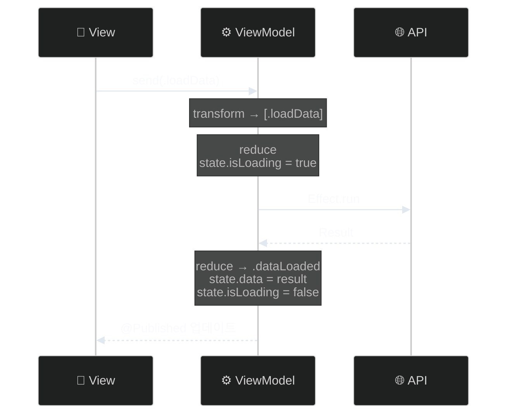

# AsyncViewModel

> Swift Concurrency 기반 단방향 데이터 흐름 ViewModel 프레임워크

[](https://swift.org)
[](https://swift.org)
[](LICENSE)

## 특징

- ✅ **단방향 데이터 흐름**: 예측 가능한 상태 관리
- ⚡ **Swift Concurrency 네이티브**: async/await 완벽 지원
- 🧪 **테스트 용이성**: AsyncTestStore로 간편한 테스트
- 🔄 **Effect 시스템**: 선언적 비동기 작업 처리
- 🪄 **매크로 지원**: 보일러플레이트 코드 자동 생성
- 📦 **제로 의존성**: 외부 라이브러리 불필요
- 🎯 **타입 세이프**: Equatable & Sendable 보장

## 목차

- [빠른 시작](#빠른-시작)
- [매크로로 간편하게](#매크로로-간편하게)
- [핵심 개념](#핵심-개념)
- [설치](#설치)
- [기본 사용법](#기본-사용법)
- [Effect 가이드](#effect-가이드)
- [테스트](#테스트)
- [예제](#예제)
- [문서](#문서)
- [라이선스](#라이선스)

## 빠른 시작

### 1. ViewModel 정의 (매크로 사용)

```swift
import AsyncViewModel  // 이 한 줄이면 Kit + Macros 모두 사용 가능!

@AsyncViewModel  // ✨ 9개 프로퍼티 + @MainActor 자동 생성!
final class CounterViewModel: ObservableObject {
    // 1️⃣ 타입 정의
    enum Input {
        case increment
        case decrement
    }
    
    enum Action: Equatable, Sendable {
        case increment
        case decrement
    }
    
    struct State: Equatable, Sendable {
        var count: Int = 0
    }
    
    enum CancelID: Hashable, Sendable {}
    
    // 2️⃣ 상태 프로퍼티
    @Published var state: State
    
    init(initialState: State = State()) {
        self.state = initialState
    }
    
    // 3️⃣ Transform: Input → Action
    func transform(_ input: Input) -> [Action] {
        switch input {
        case .increment: return [.increment]
        case .decrement: return [.decrement]
        }
    }
    
    // 4️⃣ Reduce: Action → State + Effect
    func reduce(state: inout State, action: Action) -> [AsyncEffect<Action, CancelID>] {
        switch action {
        case .increment:
            state.count += 1
            return []
        case .decrement:
            state.count -= 1
            return []
        }
    }
}
```

> 💡 **`@AsyncViewModel` 매크로**가 9개의 필수 프로퍼티를 자동으로 생성하고, 모든 멤버와 extension에 `@MainActor`를 자동 추가합니다!  
> 자세한 내용은 [매크로로 간편하게](#매크로로-간편하게) 섹션을 참고하세요.

### 2. SwiftUI에서 사용

```swift
struct CounterView: View {
    @StateObject private var viewModel = CounterViewModel()
    
    var body: some View {
        VStack(spacing: 20) {
            Text("\(viewModel.state.count)")
                .font(.largeTitle)
            
            HStack {
                Button("−") { viewModel.send(.decrement) }
                Button("+") { viewModel.send(.increment) }
            }
        }
    }
}
```

## 매크로로 간편하게

`@AsyncViewModel` 매크로는 보일러플레이트 코드를 자동 생성해줍니다.

### Import 방법

```swift
// ✅ 권장: 단일 모듈 (가장 간단!)
import AsyncViewModel  // Core + Macros 통합!

// ⚠️ Core만 필요한 경우 (매크로 없이 수동 구현)
import AsyncViewModelCore
```

### 매크로 없이 (수동)

```swift
import AsyncViewModelCore  // Core 모듈만 사용

@MainActor
final class MyViewModel: AsyncViewModelProtocol, ObservableObject {
    @Published var state: State
    
    // 😫 9개의 프로퍼티를 수동으로 선언해야 함
    var tasks: [CancelID: Task<Void, Never>] = [:]
    var effectQueue: [AsyncEffect<Action, CancelID>] = []
    var isProcessingEffects = false
    var actionObserver: ((Action) -> Void)?
    var isLoggingEnabled = false
    var logLevel: LogLevel = .info
    var stateChangeObserver: ((State, State) -> Void)?
    var effectObserver: ((AsyncEffect<Action, CancelID>) -> Void)?
    var performanceObserver: ((String, TimeInterval) -> Void)?
    
    // ... transform, reduce ...
}
```

### 매크로 사용 (권장)

```swift
import AsyncViewModel  // Kit + Macros 한 번에!

@AsyncViewModel  // ✨ 이 한 줄이면 끝!
final class MyViewModel: ObservableObject {
    @Published var state: State

    // 🎉 9개의 프로퍼티가 자동 생성됨!
    // 🎯 모든 멤버와 extension에 @MainActor가 자동 추가되어 안전한 동시성 보장

    // ... transform, reduce ...
}
```

> 💡 **@MainActor 자동 처리**:
> - 매크로가 **모든 생성된 프로퍼티**에 `@MainActor`를 자동으로 추가합니다
> - **생성된 extension**에도 `@MainActor`가 자동으로 추가됩니다
> - 따라서 클래스에 별도로 `@MainActor`를 명시할 필요가 없습니다
> - 모든 프로토콜 메서드가 안전하게 MainActor에서 실행됩니다

### 매크로 파라미터

로깅을 커스터마이징할 수 있습니다:

```swift
import AsyncViewModel

// 로깅 활성화 + 디버그 레벨
@AsyncViewModel(isLoggingEnabled: true, logLevel: .debug)
final class MyViewModel: ObservableObject {
    // 매크로가 @MainActor를 모든 멤버와 extension에 자동 추가
}

// 로깅 비활성화 (프로덕션)
@AsyncViewModel(isLoggingEnabled: false)
final class MyViewModel: ObservableObject {
    // 프로덕션에서도 @MainActor 안전성 보장
}
```

### 매크로가 생성하는 프로퍼티

| 프로퍼티 | 타입 | 용도 |
|---------|------|------|
| `tasks` | `[CancelID: Task<Void, Never>]` | 진행 중인 비동기 작업 관리 |
| `effectQueue` | `[AsyncEffect<Action, CancelID>]` | Effect 직렬 처리 큐 |
| `isProcessingEffects` | `Bool` | Effect 처리 상태 플래그 |
| `actionObserver` | `((Action) -> Void)?` | 액션 관찰 훅 (테스트/디버깅) |
| `isLoggingEnabled` | `Bool` | 로깅 활성화 플래그 |
| `logLevel` | `LogLevel` | 로깅 레벨 (.verbose, .debug, .info, .warning, .error, .fatal) |
| `stateChangeObserver` | `((State, State) -> Void)?` | 상태 변경 관찰 훅 |
| `effectObserver` | `((AsyncEffect) -> Void)?` | Effect 실행 관찰 훅 |
| `performanceObserver` | `((String, TimeInterval) -> Void)?` | 성능 메트릭 관찰 훅 |

### 로깅 레벨

```swift
public enum LogLevel: Int {
    case verbose = 0  // 가장 상세한 추적 로그 📝
    case debug = 1    // 디버깅 목적의 로그 🔍
    case info = 2     // 일반 정보성 로그 ℹ️
    case warning = 3  // 잠재적 문제 경고 ⚠️
    case error = 4    // 오류 발생 ❌
    case fatal = 5    // 치명적 오류 💀
}
```

**사용 예시:**

```swift
import AsyncViewModel

@AsyncViewModel(isLoggingEnabled: true, logLevel: .verbose)
final class DebugViewModel: ObservableObject {
    // 개발 중: 가장 상세한 로그 출력
}

@AsyncViewModel(isLoggingEnabled: true, logLevel: .debug)
final class DevelopmentViewModel: ObservableObject {
    // 개발 중: 디버그 레벨 이상 로그 출력
}

@AsyncViewModel(isLoggingEnabled: true, logLevel: .error)
final class ProductionViewModel: ObservableObject {
    // 프로덕션: 에러만 로깅
}
```

> **Note**: LogLevel은 TraceKit의 TraceLevel과 동일한 구조를 가지고 있습니다.

## 핵심 개념

AsyncViewModel은 **단방향 데이터 흐름**으로 동작합니다:

```mermaid
%%{init: {'theme': 'dark', 'themeVariables': {'lineColor': '#e2e8f0', 'textColor': '#f8fafc'}}}%%
flowchart LR
    A[👤 Input]:::input -->|transform| B[⚙️ Action]:::action
    B -->|reduce| C[📦 State]:::state
    C -->|@Published| D[📱 View]:::view
    B -->|Effect| E[🌐 비동기 작업]:::effect
    E -->|Action| B
    
    classDef input fill:#3b82f6,stroke:#60a5fa,color:#ffffff
    classDef action fill:#8b5cf6,stroke:#a78bfa,color:#ffffff
    classDef state fill:#10b981,stroke:#34d399,color:#ffffff
    classDef view fill:#06b6d4,stroke:#22d3ee,color:#ffffff
    classDef effect fill:#f59e0b,stroke:#fbbf24,color:#1f2937
```

### 4가지 핵심 타입

| 타입 | 역할 | 예시 |
|------|------|------|
| **Input** | 사용자 이벤트 | `.buttonTapped`, `.textChanged(String)` |
| **Action** | 구체적 작업 | `.loadData`, `.dataLoaded(Data)`, `.error(Error)` |
| **State** | 앱 상태 | `var isLoading: Bool`, `var items: [Item]` |
| **Effect** | 비동기 작업 | `.run { try await api.fetch() }` |

### 데이터 흐름



## 설치

### Swift Package Manager

```swift
dependencies: [
    .package(url: "https://github.com/yourusername/AsyncViewModel.git", from: "1.0.0")
]
```

**타겟 의존성 추가:**

```swift
.target(
    name: "YourTarget",
    dependencies: [
        // 권장: 통합 모듈 (Core + Macros 포함)
        .product(name: "AsyncViewModel", package: "AsyncViewModel"),
        
        // 또는 매크로 없이 Core만 사용
        // .product(name: "AsyncViewModelCore", package: "AsyncViewModel"),
    ]
)
```

또는 Xcode에서:
1. **File → Add Package Dependencies...**
2. URL 입력: `https://github.com/yourusername/AsyncViewModel.git`
3. **Add Package**
4. **`AsyncViewModel`** 선택 (권장 - Core + Macros 포함)

### 로깅 라이브러리 (TraceKit)

AsyncViewModel은 [TraceKit](https://github.com/Jimmy-Jung/TraceKit) (v1.1.1)을 로깅 라이브러리로 사용합니다.

TraceKit은 자동으로 의존성으로 포함되므로 별도 설치가 필요 없습니다.

TraceKit 기능:
- 고급 버퍼링 및 샘플링
- 민감정보 자동 마스킹
- 크래시 로그 보존
- 성능 측정 지원
- 다양한 Destination (Console, OSLog, File, 외부 서비스)

### 요구사항

- iOS 15.0+ / macOS 12.0+ / tvOS 15.0+ / watchOS 8.0+
- Swift 6.1+
- Xcode 16.0+ (매크로 지원)

## 기본 사용법

### Transform: Input을 Action으로 변환

```swift
func transform(_ input: Input) -> [Action] {
    switch input {
    case .buttonTapped:
        // 하나의 입력 → 여러 액션
        return [.trackAnalytics, .loadData]
        
    case let .textChanged(text):
        // 조건부 액션
        return text.isEmpty ? [.clearResults] : [.search(text)]
    }
}
```

**언제 사용?**
- 하나의 입력을 여러 액션으로 분해
- 조건에 따라 다른 액션 실행
- 입력 이벤트를 도메인 액션으로 변환

### Reduce: 상태 변경 + Effect 반환

```swift
func reduce(state: inout State, action: Action) -> [AsyncEffect<Action, CancelID>] {
    switch action {
    case .loadData:
        state.isLoading = true
        return [
            .run(id: .dataFetch) {
                try await api.fetchData()
            }
        ]
        
    case let .dataLoaded(data):
        state.isLoading = false
        state.data = data
        return []
        
    case let .error(error):
        state.isLoading = false
        state.error = error.localizedDescription
        return []
    }
}
```

**핵심 원칙:**
- ✅ **순수 함수**: 같은 입력 → 같은 결과
- ✅ **동기적**: 즉시 실행되고 반환
- ✅ **예측 가능**: 상태 변경만 담당

## Effect 가이드

Effect는 비동기 작업을 선언적으로 표현합니다.

### 기본 Effect

```swift
// 1️⃣ .none - 아무것도 안 함
case .updateUI:
    state.message = "완료"
    return []

// 2️⃣ .action - 다른 액션 실행
case .loginSuccess:
    state.isLoggedIn = true
    return [.action(.loadUserData)]

// 3️⃣ .run - 비동기 작업
case .loadUser:
    return [
        .run(id: .fetchUser) {
            try await userAPI.fetch()
        }
    ]

// 4️⃣ .cancel - 작업 취소
case .cancelSearch:
    return [.cancel(id: .search)]
```

### 고급 Effect

#### 병렬 실행 (.concurrent)

여러 작업을 **동시에** 실행합니다:

```swift
case .loadDashboard:
    return .concurrent([
        .run { try await fetchUser() },      // ⚡
        .run { try await fetchPosts() },     // ⚡ 동시 실행
        .run { try await fetchComments() }   // ⚡
    ])
// 성능: max(500ms, 300ms, 200ms) = 500ms
```

#### 순차 실행 (배열)

여러 작업을 **차례대로** 실행합니다:

```swift
case .checkout:
    return [
        .action(.validateCart),      // 1️⃣
        .action(.processPayment),    // 2️⃣
        .action(.sendConfirmation)   // 3️⃣
    ]
// 실행 시간: 500ms + 300ms + 200ms = 1000ms
```

#### Debounce - 입력 완료 대기

```swift
case let .searchTextChanged(query):
    state.query = query
    return [
        .cancel(id: .search),
        .debounce(id: .search, for: 0.3) {
            try await searchAPI.search(query)
        }
    ]
```

#### 에러를 상태로 관리

```swift
case .loadData:
    state.isLoading = true
    return [
        .runCatchingError(
            errorAction: { .loadFailed($0.localizedDescription) }
        ) {
            let data = try await api.fetchData()
            return .dataLoaded(data)
        }
    ]

case let .loadFailed(message):
    state.isLoading = false
    state.errorMessage = message
    state.showError = true
    return []
```

### Effect 빠른 참조

| Effect | 용도 | 예시 |
|--------|------|------|
| `.run` | 비동기 작업 | 네트워크, 파일 I/O |
| `.concurrent` | 병렬 실행 | 독립적인 여러 API 호출 |
| `.cancel` | 작업 취소 | 검색, 타임아웃 |
| `.debounce` | 입력 완료 대기 | 검색, 자동 저장 |
| `.throttle` | 호출 빈도 제한 | 스크롤 추적 |
| `.sleep` | 단순 대기 | 딜레이 |
| `.sleepThen` | 대기 후 액션 | 알림 자동 닫기 |

## 테스트

AsyncViewModel은 테스트하기 쉽게 설계되었습니다.

```swift
import Testing
import AsyncViewModel  // Core 포함

@MainActor
@Test("카운터 증가 테스트")
func testIncrement() async throws {
    // Given
    let viewModel = CounterViewModel()
    let store = AsyncTestStore(viewModel: viewModel)
    defer { store.cleanup() }
    
    // When
    store.send(.increment)
    
    // Then
    #expect(store.state.count == 1)
    #expect(store.actions == [.increment])
}

@Test("비동기 데이터 로드")
func testLoadData() async throws {
    let viewModel = DataViewModel()
    let store = AsyncTestStore(viewModel: viewModel)
    defer { store.cleanup() }
    
    store.send(.loadData)
    
    // 모든 Effect 완료 대기
    try await store.waitForEffects(timeout: 1.0)
    
    #expect(store.state.isLoading == false)
    #expect(store.state.data.isEmpty == false)
}

@Test("상태 변화 대기")
func testStateChange() async throws {
    let store = AsyncTestStore(viewModel: viewModel)
    defer { store.cleanup() }
    
    store.send(.loadData)
    
    // 특정 조건까지 대기
    try await store.wait(for: { $0.data.count > 0 }, timeout: 2.0)
    
    #expect(store.state.data.count > 0)
}
```

## 예제

프로젝트에 포함된 예제:

### 계산기 예제

4가지 아키텍처로 구현된 계산기:

- **SwiftUI + AsyncViewModel** - 권장 패턴
- **UIKit + AsyncViewModel** - UIKit 지원
- **ReactorKit** - 비교용
- **TCA (The Composable Architecture)** - 비교용

```bash
cd src/Example
make setup
make generate
open AsyncViewModel.xcworkspace
```

### 실전 예제: 검색 기능

```swift
import AsyncViewModel

@AsyncViewModel
final class SearchViewModel: ObservableObject {
    struct State: Equatable, Sendable {
        var query: String = ""
        var results: [Item] = []
        var isSearching = false
    }
    
    enum Input {
        case queryChanged(String)
        case cancelSearch
    }
    
    enum Action: Equatable, Sendable {
        case updateQuery(String)
        case searchStarted
        case resultsReceived([Item])
        case searchCancelled
    }
    
    enum CancelID: Hashable, Sendable {
        case search
    }
    
    @Published var state: State
    
    init(initialState: State = State()) {
        self.state = initialState
    }
    
    func transform(_ input: Input) -> [Action] {
        switch input {
        case let .queryChanged(query):
            return [.updateQuery(query), .searchStarted]
        case .cancelSearch:
            return [.searchCancelled]
        }
    }
    
    func reduce(state: inout State, action: Action) -> [AsyncEffect<Action, CancelID>] {
        switch action {
        case let .updateQuery(query):
            state.query = query
            return []
            
        case .searchStarted:
            guard !state.query.isEmpty else {
                state.results = []
                return []
            }
            
            state.isSearching = true
            return [
                .cancel(id: .search),
                .debounce(id: .search, for: 0.3) {
                    try await searchAPI.search(state.query)
                }
            ]
            
        case let .resultsReceived(results):
            state.isSearching = false
            state.results = results
            return []
            
        case .searchCancelled:
            state.isSearching = false
            state.results = []
            return [.cancel(id: .search)]
        }
    }
}
```

## 문서

- 📖 [AsyncViewModel 동작원리 가이드](AsyncViewModel_동작원리_가이드.md) - 내부 동작 상세 설명
- 🎯 [예제 프로젝트 README](src/Example/README.md) - 예제 실행 가이드
- 🧪 [테스트 가이드](docs/Testing.md) - 테스트 작성법 (작성 예정)
- ⚡ [성능 최적화](docs/Performance.md) - 성능 팁 (작성 예정)

## FAQ

### Q: 매크로를 꼭 사용해야 하나요?

아니요! 매크로는 선택사항입니다:

- ✅ **매크로 사용 (권장)**: 보일러플레이트 코드 자동 생성, 간결함
  - `import AsyncViewModel` (Core + Macros 통합)
- ✅ **수동 구현**: 완전한 제어, 매크로 없이도 사용 가능
  - `import AsyncViewModelCore`만 사용

두 방식 모두 동일하게 동작합니다.

### Q: AsyncViewModel vs TCA의 차이는?

| 특징 | AsyncViewModel | TCA |
|------|----------------|-----|
| 학습 곡선 | ⭐⭐ 보통 | ⭐⭐⭐ 어려움 |
| 보일러플레이트 | 적음 (매크로) | 많음 |
| 외부 의존성 | 없음 | TCA 라이브러리 |
| 유연성 | 높음 | 구조화됨 |

### Q: Input과 Action을 분리하는 이유는?

**Input**: UI 이벤트 (비즈니스 로직과 무관)  
**Action**: 도메인 액션 (비즈니스 로직)

분리하면:
- 하나의 입력을 여러 액션으로 변환 가능
- 조건부 액션 생성 가능
- UI와 비즈니스 로직 분리

간단한 경우 `Input = Action`으로 통합 가능합니다.

### Q: Effect가 실패하면?

```swift
// 기본: handleError 호출 (로깅만)
.run { try await api.fetch() }

// 권장: 에러를 상태로 관리
.runCatchingError(errorAction: { .apiFailed($0) }) {
    try await api.fetch()
}
```

### Q: 로깅을 커스터마이징하려면?

```swift
import AsyncViewModel

// 1. 매크로 파라미터로 설정
@AsyncViewModel(isLoggingEnabled: true, logLevel: .debug)

// 2. 런타임에 변경
viewModel.isLoggingEnabled = false
viewModel.logLevel = .error

// 3. TraceKit 통합 (권장)
// TraceKit은 AsyncViewModel에 기본 포함되어 있습니다
Task { @TraceKitActor in
    await TraceKitBuilder.debug().buildAsShared()
}

Task { @MainActor in
    let logger = TraceKitViewModelLogger()
    LoggerConfiguration.setLogger(logger)
}

// 4. 관찰자 훅 사용
viewModel.actionObserver = { action in
    print("Action:", action)
}
viewModel.performanceObserver = { operation, duration in
    print("\(operation): \(duration)s")
}
```

자세한 내용은 [LOGGING_ARCHITECTURE.md](LOGGING_ARCHITECTURE.md)와 [QUICK_START_LOGGING.md](QUICK_START_LOGGING.md)를 참고하세요.

### Q: import 방식의 차이는?

| Import 방식 | 포함 내용 | 사용 시나리오 |
|------------|----------|-------------|
| `import AsyncViewModel` | Core + Macros | ✅ **권장**: 대부분의 경우 |
| `import AsyncViewModelCore` | Core만 | 매크로 없이 수동 구현 |

AsyncViewModel은 **단일 통합 모듈**로 사용하는 것이 가장 간단합니다!

## 기여하기

Pull Request를 환영합니다! 🎉

1. Fork
2. Feature 브랜치 생성 (`git checkout -b feature/amazing`)
3. 변경사항 커밋 (`git commit -m 'Add amazing feature'`)
4. 푸시 (`git push origin feature/amazing`)
5. Pull Request 생성

## 라이선스

MIT License - 자유롭게 사용하세요!

## 만든 사람

jimmy (정준영)

**이 프레임워크가 도움이 되었나요?** ⭐ Star를 눌러주세요!

---

<p align="center">
Made with ❤️ and ☕ in Korea
</p>
