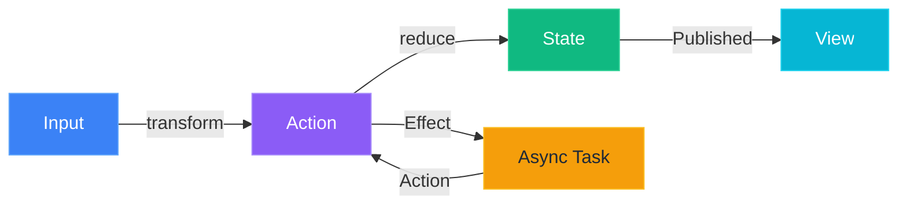
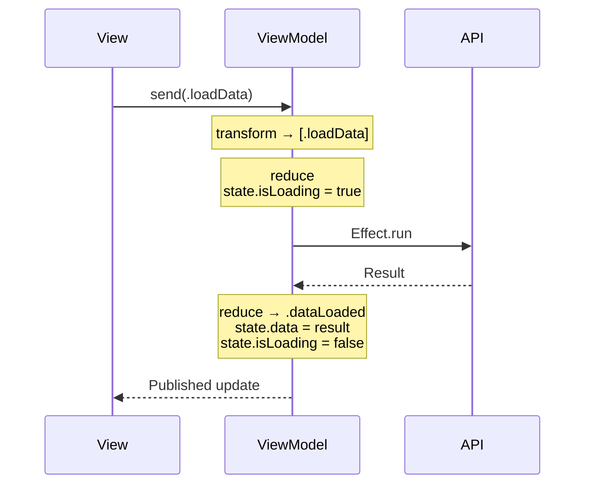

<div align="center">

# AsyncViewModel

### Swift Concurrency 기반 단방향 데이터 흐름 ViewModel 프레임워크

[](https://swift.org)
[](https://developer.apple.com/swift)
[](LICENSE)
[](https://github.com/Jimmy-Jung/AsyncViewModel/releases)
[](https://github.com/Jimmy-Jung/AsyncViewModel/actions/workflows/ci.yml)
[](https://codecov.io/gh/Jimmy-Jung/AsyncViewModel)
[](https://swift.org/package-manager)

[English](#) | [한국어](#-korean)

</div>

---

## 왜 AsyncViewModel인가?

AsyncViewModel은 Swift Concurrency(async/await)를 활용한 현대적인 상태 관리 프레임워크입니다.

### 주요 특징

- ✅ **단방향 데이터 흐름**: 예측 가능한 상태 관리로 버그 감소
- ⚡ **Swift Concurrency 네이티브**: async/await 완벽 지원으로 간결한 비동기 코드
- 🧪 **테스트 용이성**: AsyncTestStore로 비동기 로직을 쉽게 테스트
- 🔄 **선언적 Effect 시스템**: 복잡한 비동기 작업을 선언적으로 표현
- 🪄 **매크로 지원**: 보일러플레이트 코드 자동 생성으로 생산성 향상
- 📦 **제로 의존성**: 외부 라이브러리 불필요 (로깅을 위한 TraceKit 포함)
- 🎯 **타입 세이프**: Equatable & Sendable 보장으로 컴파일 타임 안정성
- 🔌 **유연한 아키텍처**: SwiftUI, UIKit 모두 지원

### 다른 프레임워크와 비교

| 특징 | AsyncViewModel | TCA | ReactorKit | Redux |
|------|----------------|-----|------------|-------|
| 학습 곡선 | ⭐⭐ 보통 | ⭐⭐⭐ 어려움 | ⭐⭐ 보통 | ⭐⭐ 보통 |
| Swift Concurrency | ✅ 네이티브 | ✅ 네이티브 | ❌ RxSwift | ❌ 없음 |
| 보일러플레이트 | 적음 (매크로) | 많음 | 중간 | 많음 |
| 외부 의존성 | 없음 | TCA 라이브러리 | RxSwift | 없음 |
| 테스트 지원 | ✅ AsyncTestStore | ✅ TestStore | ✅ RxTest | ⚠️ 수동 |
| UI 프레임워크 | SwiftUI, UIKit | 주로 SwiftUI | 주로 UIKit | 범용 |

### 누가 사용하면 좋을까요?

- ✅ Swift Concurrency를 활용하고 싶은 개발자
- ✅ 예측 가능한 상태 관리가 필요한 프로젝트
- ✅ 테스트 가능한 아키텍처를 원하는 팀
- ✅ 보일러플레이트 코드를 줄이고 싶은 개발자
- ✅ SwiftUI 또는 UIKit 프로젝트 모두 지원 필요

## 목차

- [왜 AsyncViewModel인가?](#왜-asyncviewmodel인가)
- [빠른 시작](#빠른-시작)
- [설치](#설치)
- [매크로로 간편하게](#매크로로-간편하게)
- [핵심 개념](#핵심-개념)
- [기본 사용법](#기본-사용법)
- [Effect 가이드](#effect-가이드)
- [테스트](#테스트)
- [예제](#예제)
- [문서](#문서)
- [로드맵](#로드맵)
- [기여하기](#기여하기)
- [커뮤니티](#커뮤니티)
- [라이선스](#라이선스)
- [감사의 말](#감사의-말)

## 빠른 시작

### 1. ViewModel 정의 (매크로 사용)

```swift
import AsyncViewModel  // 이 한 줄이면 Kit + Macros 모두 사용 가능!

@AsyncViewModel  // ✨ 9개 프로퍼티 + @MainActor 자동 생성!
final class CounterViewModel: ObservableObject {
    // 1️⃣ 타입 정의
    enum Input {
        case increment
        case decrement
    }
    
    enum Action: Equatable, Sendable {
        case increment
        case decrement
    }
    
    struct State: Equatable, Sendable {
        var count: Int = 0
    }
    
    enum CancelID: Hashable, Sendable {}
    
    // 2️⃣ 상태 프로퍼티
    @Published var state: State
    
    init(initialState: State = State()) {
        self.state = initialState
    }
    
    // 3️⃣ Transform: Input → Action
    func transform(_ input: Input) -> [Action] {
        switch input {
        case .increment: return [.increment]
        case .decrement: return [.decrement]
        }
    }
    
    // 4️⃣ Reduce: Action → State + Effect
    func reduce(state: inout State, action: Action) -> [AsyncEffect<Action, CancelID>] {
        switch action {
        case .increment:
            state.count += 1
            return []
        case .decrement:
            state.count -= 1
            return []
        }
    }
}
```

> 💡 **`@AsyncViewModel` 매크로**가 9개의 필수 프로퍼티를 자동으로 생성하고, 모든 멤버와 extension에 `@MainActor`를 자동 추가합니다!  
> 자세한 내용은 [매크로로 간편하게](#매크로로-간편하게) 섹션을 참고하세요.

### 2. SwiftUI에서 사용

```swift
struct CounterView: View {
    @StateObject private var viewModel = CounterViewModel()
    
    var body: some View {
        VStack(spacing: 20) {
            Text("\(viewModel.state.count)")
                .font(.largeTitle)
            
            HStack {
                Button("−") { viewModel.send(.decrement) }
                Button("+") { viewModel.send(.increment) }
            }
        }
    }
}
```

## 매크로로 간편하게

`@AsyncViewModel` 매크로는 보일러플레이트 코드를 자동 생성해줍니다.

### Import 방법

```swift
// ✅ 권장: 단일 모듈 (가장 간단!)
import AsyncViewModel  // Core + Macros 통합!

// ⚠️ Core만 필요한 경우 (매크로 없이 수동 구현)
import AsyncViewModelCore
```

### 매크로 없이 (수동)

```swift
import AsyncViewModelCore  // Core 모듈만 사용

@MainActor
final class MyViewModel: AsyncViewModelProtocol, ObservableObject {
    @Published var state: State
    
    // 😫 9개의 프로퍼티를 수동으로 선언해야 함
    var tasks: [CancelID: Task<Void, Never>] = [:]
    var effectQueue: [AsyncEffect<Action, CancelID>] = []
    var isProcessingEffects = false
    var actionObserver: ((Action) -> Void)?
    var isLoggingEnabled = false
    var logLevel: LogLevel = .info
    var stateChangeObserver: ((State, State) -> Void)?
    var effectObserver: ((AsyncEffect<Action, CancelID>) -> Void)?
    var performanceObserver: ((String, TimeInterval) -> Void)?
    
    // ... transform, reduce ...
}
```

### 매크로 사용 (권장)

```swift
import AsyncViewModel  // Kit + Macros 한 번에!

@AsyncViewModel  // ✨ 이 한 줄이면 끝!
final class MyViewModel: ObservableObject {
    @Published var state: State

    // 🎉 9개의 프로퍼티가 자동 생성됨!
    // 🎯 모든 멤버와 extension에 @MainActor가 자동 추가되어 안전한 동시성 보장

    // ... transform, reduce ...
}
```

> 💡 **@MainActor 자동 처리**:
> - 매크로가 **모든 생성된 프로퍼티**에 `@MainActor`를 자동으로 추가합니다
> - **생성된 extension**에도 `@MainActor`가 자동으로 추가됩니다
> - 따라서 클래스에 별도로 `@MainActor`를 명시할 필요가 없습니다
> - 모든 프로토콜 메서드가 안전하게 MainActor에서 실행됩니다

### 매크로 파라미터

로깅을 커스터마이징할 수 있습니다:

```swift
import AsyncViewModel

// 로깅 활성화 + 디버그 레벨
@AsyncViewModel(isLoggingEnabled: true, logLevel: .debug)
final class MyViewModel: ObservableObject {
    // 매크로가 @MainActor를 모든 멤버와 extension에 자동 추가
}

// 로깅 비활성화 (프로덕션)
@AsyncViewModel(isLoggingEnabled: false)
final class MyViewModel: ObservableObject {
    // 프로덕션에서도 @MainActor 안전성 보장
}
```

### 매크로가 생성하는 프로퍼티

| 프로퍼티 | 타입 | 용도 |
|---------|------|------|
| `tasks` | `[CancelID: Task<Void, Never>]` | 진행 중인 비동기 작업 관리 |
| `effectQueue` | `[AsyncEffect<Action, CancelID>]` | Effect 직렬 처리 큐 |
| `isProcessingEffects` | `Bool` | Effect 처리 상태 플래그 |
| `actionObserver` | `((Action) -> Void)?` | 액션 관찰 훅 (테스트/디버깅) |
| `isLoggingEnabled` | `Bool` | 로깅 활성화 플래그 |
| `logLevel` | `LogLevel` | 로깅 레벨 (.verbose, .debug, .info, .warning, .error, .fatal) |
| `stateChangeObserver` | `((State, State) -> Void)?` | 상태 변경 관찰 훅 |
| `effectObserver` | `((AsyncEffect) -> Void)?` | Effect 실행 관찰 훅 |
| `performanceObserver` | `((String, TimeInterval) -> Void)?` | 성능 메트릭 관찰 훅 |

### 로깅 레벨

```swift
public enum LogLevel: Int {
    case verbose = 0  // 가장 상세한 추적 로그 📝
    case debug = 1    // 디버깅 목적의 로그 🔍
    case info = 2     // 일반 정보성 로그 ℹ️
    case warning = 3  // 잠재적 문제 경고 ⚠️
    case error = 4    // 오류 발생 ❌
    case fatal = 5    // 치명적 오류 💀
}
```

**사용 예시:**

```swift
import AsyncViewModel

@AsyncViewModel(isLoggingEnabled: true, logLevel: .verbose)
final class DebugViewModel: ObservableObject {
    // 개발 중: 가장 상세한 로그 출력
}

@AsyncViewModel(isLoggingEnabled: true, logLevel: .debug)
final class DevelopmentViewModel: ObservableObject {
    // 개발 중: 디버그 레벨 이상 로그 출력
}

@AsyncViewModel(isLoggingEnabled: true, logLevel: .error)
final class ProductionViewModel: ObservableObject {
    // 프로덕션: 에러만 로깅
}
```

> **Note**: LogLevel은 TraceKit의 TraceLevel과 동일한 구조를 가지고 있습니다.

## 핵심 개념

AsyncViewModel은 **단방향 데이터 흐름**으로 동작합니다:



### 4가지 핵심 타입

| 타입 | 역할 | 예시 |
|------|------|------|
| **Input** | 사용자 이벤트 | `.buttonTapped`, `.textChanged(String)` |
| **Action** | 구체적 작업 | `.loadData`, `.dataLoaded(Data)`, `.error(Error)` |
| **State** | 앱 상태 | `var isLoading: Bool`, `var items: [Item]` |
| **Effect** | 비동기 작업 | `.run { try await api.fetch() }` |

### 데이터 흐름



## 설치

### 요구사항

| 플랫폼 | 최소 버전 |
|--------|----------|
| iOS | 15.0+ |
| macOS | 12.0+ |
| tvOS | 15.0+ |
| watchOS | 8.0+ |
| Swift | 6.0+ |
| Xcode | 16.0+ |

### Swift Package Manager

#### Package.swift에 추가

```swift
dependencies: [
    .package(url: "https://github.com/Jimmy-Jung/AsyncViewModel.git", from: "1.0.0")
]
```

**타겟 의존성 추가:**

```swift
.target(
    name: "YourTarget",
    dependencies: [
        // ✅ 권장: 통합 모듈 (Core + Macros 포함)
        .product(name: "AsyncViewModel", package: "AsyncViewModel"),
        
        // 또는 매크로 없이 Core만 사용
        // .product(name: "AsyncViewModelCore", package: "AsyncViewModel"),
    ]
)
```

#### Xcode에서 추가

1. **File → Add Package Dependencies...**
2. 검색창에 입력: `https://github.com/Jimmy-Jung/AsyncViewModel.git`
3. **Add Package** 클릭
4. **`AsyncViewModel`** 선택 (권장 - Core + Macros 포함)

### 로깅 통합 (선택 사항)

AsyncViewModel은 [TraceKit](https://github.com/Jimmy-Jung/TraceKit)을 로깅 라이브러리로 통합할 수 있습니다.

> **참고**: TraceKit은 선택적 통합이며, 별도로 설치해야 합니다.

**TraceKit 주요 기능:**
- 🎯 고급 버퍼링 및 샘플링
- 🔒 민감정보 자동 마스킹
- 💾 크래시 로그 보존
- ⚡ 성능 측정 지원
- 📤 다양한 Destination (Console, OSLog, File, 외부 서비스)

TraceKit 통합 방법은 [Logger Configuration 가이드](Documents/02-Logger-Configuration.md)를 참고하세요.

## 기본 사용법

### Transform: Input을 Action으로 변환

```swift
func transform(_ input: Input) -> [Action] {
    switch input {
    case .buttonTapped:
        // 하나의 입력 → 여러 액션
        return [.trackAnalytics, .loadData]
        
    case let .textChanged(text):
        // 조건부 액션
        return text.isEmpty ? [.clearResults] : [.search(text)]
    }
}
```

**언제 사용?**
- 하나의 입력을 여러 액션으로 분해
- 조건에 따라 다른 액션 실행
- 입력 이벤트를 도메인 액션으로 변환

### Reduce: 상태 변경 + Effect 반환

```swift
func reduce(state: inout State, action: Action) -> [AsyncEffect<Action, CancelID>] {
    switch action {
    case .loadData:
        state.isLoading = true
        return [
            .run(id: .dataFetch) {
                try await api.fetchData()
            }
        ]
        
    case let .dataLoaded(data):
        state.isLoading = false
        state.data = data
        return []
        
    case let .error(error):
        state.isLoading = false
        state.error = error.localizedDescription
        return []
    }
}
```

**핵심 원칙:**
- ✅ **순수 함수**: 같은 입력 → 같은 결과
- ✅ **동기적**: 즉시 실행되고 반환
- ✅ **예측 가능**: 상태 변경만 담당

## Effect 가이드

Effect는 비동기 작업을 선언적으로 표현합니다.

### 기본 Effect

```swift
// 1️⃣ .none - 아무것도 안 함
case .updateUI:
    state.message = "완료"
    return []

// 2️⃣ .action - 다른 액션 실행
case .loginSuccess:
    state.isLoggedIn = true
    return [.action(.loadUserData)]

// 3️⃣ .run - 비동기 작업
case .loadUser:
    return [
        .run(id: .fetchUser) {
            try await userAPI.fetch()
        }
    ]

// 4️⃣ .cancel - 작업 취소
case .cancelSearch:
    return [.cancel(id: .search)]
```

### 고급 Effect

#### 병렬 실행 (.concurrent)

여러 작업을 **동시에** 실행합니다:

```swift
case .loadDashboard:
    return .concurrent([
        .run { try await fetchUser() },      // ⚡
        .run { try await fetchPosts() },     // ⚡ 동시 실행
        .run { try await fetchComments() }   // ⚡
    ])
// 성능: max(500ms, 300ms, 200ms) = 500ms
```

#### 순차 실행 (배열)

여러 작업을 **차례대로** 실행합니다:

```swift
case .checkout:
    return [
        .action(.validateCart),      // 1️⃣
        .action(.processPayment),    // 2️⃣
        .action(.sendConfirmation)   // 3️⃣
    ]
// 실행 시간: 500ms + 300ms + 200ms = 1000ms
```

#### Debounce - 입력 완료 대기

```swift
case let .searchTextChanged(query):
    state.query = query
    return [
        .cancel(id: .search),
        .debounce(id: .search, for: 0.3) {
            try await searchAPI.search(query)
        }
    ]
```

#### 에러를 상태로 관리

```swift
case .loadData:
    state.isLoading = true
    return [
        .runCatchingError(
            errorAction: { .loadFailed($0.localizedDescription) }
        ) {
            let data = try await api.fetchData()
            return .dataLoaded(data)
        }
    ]

case let .loadFailed(message):
    state.isLoading = false
    state.errorMessage = message
    state.showError = true
    return []
```

### Effect 빠른 참조

| Effect | 용도 | 예시 |
|--------|------|------|
| `.run` | 비동기 작업 | 네트워크, 파일 I/O |
| `.concurrent` | 병렬 실행 | 독립적인 여러 API 호출 |
| `.cancel` | 작업 취소 | 검색, 타임아웃 |
| `.debounce` | 입력 완료 대기 | 검색, 자동 저장 |
| `.throttle` | 호출 빈도 제한 | 스크롤 추적 |
| `.sleep` | 단순 대기 | 딜레이 |
| `.sleepThen` | 대기 후 액션 | 알림 자동 닫기 |

## 테스트

AsyncViewModel은 테스트하기 쉽게 설계되었습니다.

```swift
import Testing
import AsyncViewModel  // Core 포함

@MainActor
@Test("카운터 증가 테스트")
func testIncrement() async throws {
    // Given
    let viewModel = CounterViewModel()
    let store = AsyncTestStore(viewModel: viewModel)
    defer { store.cleanup() }
    
    // When
    store.send(.increment)
    
    // Then
    #expect(store.state.count == 1)
    #expect(store.actions == [.increment])
}

@Test("비동기 데이터 로드")
func testLoadData() async throws {
    let viewModel = DataViewModel()
    let store = AsyncTestStore(viewModel: viewModel)
    defer { store.cleanup() }
    
    store.send(.loadData)
    
    // 모든 Effect 완료 대기
    try await store.waitForEffects(timeout: 1.0)
    
    #expect(store.state.isLoading == false)
    #expect(store.state.data.isEmpty == false)
}

@Test("상태 변화 대기")
func testStateChange() async throws {
    let store = AsyncTestStore(viewModel: viewModel)
    defer { store.cleanup() }
    
    store.send(.loadData)
    
    // 특정 조건까지 대기
    try await store.wait(for: { $0.data.count > 0 }, timeout: 2.0)
    
    #expect(store.state.data.count > 0)
}
```

## 예제

프로젝트에 포함된 예제:

### 계산기 예제

4가지 아키텍처로 구현된 계산기:

- **SwiftUI + AsyncViewModel** - 권장 패턴
- **UIKit + AsyncViewModel** - UIKit 지원
- **ReactorKit** - 비교용
- **TCA (The Composable Architecture)** - 비교용

```bash
cd Projects/AsyncViewModelExample
make setup
make generate
open AsyncViewModelExample.xcworkspace
```

### 실전 예제: 검색 기능

```swift
import AsyncViewModel

@AsyncViewModel
final class SearchViewModel: ObservableObject {
    struct State: Equatable, Sendable {
        var query: String = ""
        var results: [Item] = []
        var isSearching = false
    }
    
    enum Input {
        case queryChanged(String)
        case cancelSearch
    }
    
    enum Action: Equatable, Sendable {
        case updateQuery(String)
        case searchStarted
        case resultsReceived([Item])
        case searchCancelled
    }
    
    enum CancelID: Hashable, Sendable {
        case search
    }
    
    @Published var state: State
    
    init(initialState: State = State()) {
        self.state = initialState
    }
    
    func transform(_ input: Input) -> [Action] {
        switch input {
        case let .queryChanged(query):
            return [.updateQuery(query), .searchStarted]
        case .cancelSearch:
            return [.searchCancelled]
        }
    }
    
    func reduce(state: inout State, action: Action) -> [AsyncEffect<Action, CancelID>] {
        switch action {
        case let .updateQuery(query):
            state.query = query
            return []
            
        case .searchStarted:
            guard !state.query.isEmpty else {
                state.results = []
                return []
            }
            
            state.isSearching = true
            return [
                .cancel(id: .search),
                .debounce(id: .search, for: 0.3) {
                    try await searchAPI.search(state.query)
                }
            ]
            
        case let .resultsReceived(results):
            state.isSearching = false
            state.results = results
            return []
            
        case .searchCancelled:
            state.isSearching = false
            state.results = []
            return [.cancel(id: .search)]
        }
    }
}
```

## 문서

### 📚 핵심 문서

| 번호 | 문서명 | 설명 | 난이도 |
|-----|-------|------|-------|
| 01 | [Internal Architecture](Documents/01-Internal-Architecture.md) | AsyncViewModel 내부 동작 원리 상세 설명 | ⭐⭐⭐ |
| 02 | [Logger Configuration](Documents/02-Logger-Configuration.md) | ViewModelLoggerBuilder 사용 가이드 | ⭐⭐ |
| 03 | [GitHub Actions Guide](Documents/03-GitHub-Actions-Guide.md) | CI/CD 파이프라인 설정 가이드 | ⭐⭐ |
| 04 | [Release Checklist](Documents/04-Release-Checklist.md) | 릴리스 체크리스트 및 절차 | ⭐⭐ |
| 05 | [AsyncTimer & Lifecycle Guide](Documents/05-AsyncTimer-And-Lifecycle-Guide.md) | 시간 기반 작업과 생명주기 관리 완벽 가이드 | ⭐⭐ |

### 🎯 추가 리소스

- 🎯 [예제 프로젝트 README](Projects/AsyncViewModelExample/README.md) - 예제 실행 가이드
- 🧪 [테스트 가이드](docs/Testing.md) - 테스트 작성법 (작성 예정)
- ⚡ [성능 최적화](docs/Performance.md) - 성능 팁 (작성 예정)

### 📖 추천 읽기 순서

1. **시작하기**: README 빠른 시작 섹션
2. **기본 개념**: 핵심 개념 및 기본 사용법
3. **심화 학습**: Internal Architecture 문서
4. **로깅 설정**: Logger Configuration 문서
5. **실전 활용**: 예제 프로젝트

## FAQ

### Q: 매크로를 꼭 사용해야 하나요?

아니요! 매크로는 선택사항입니다:

- ✅ **매크로 사용 (권장)**: 보일러플레이트 코드 자동 생성, 간결함
  - `import AsyncViewModel` (Core + Macros 통합)
- ✅ **수동 구현**: 완전한 제어, 매크로 없이도 사용 가능
  - `import AsyncViewModelCore`만 사용

두 방식 모두 동일하게 동작합니다.

### Q: AsyncViewModel vs TCA의 차이는?

| 특징 | AsyncViewModel | TCA |
|------|----------------|-----|
| 학습 곡선 | ⭐⭐ 보통 | ⭐⭐⭐ 어려움 |
| 보일러플레이트 | 적음 (매크로) | 많음 |
| 외부 의존성 | 없음 | TCA 라이브러리 |
| 유연성 | 높음 | 구조화됨 |

### Q: Input과 Action을 분리하는 이유는?

**Input**: UI 이벤트 (비즈니스 로직과 무관)  
**Action**: 도메인 액션 (비즈니스 로직)

분리하면:
- 하나의 입력을 여러 액션으로 변환 가능
- 조건부 액션 생성 가능
- UI와 비즈니스 로직 분리

간단한 경우 `Input = Action`으로 통합 가능합니다.

### Q: Effect가 실패하면?

```swift
// 기본: handleError 호출 (로깅만)
.run { try await api.fetch() }

// 권장: 에러를 상태로 관리
.runCatchingError(errorAction: { .apiFailed($0) }) {
    try await api.fetch()
}
```

### Q: 로깅을 커스터마이징하려면?

```swift
import AsyncViewModel

// 1. 매크로 파라미터로 설정
@AsyncViewModel(isLoggingEnabled: true, logLevel: .debug)

// 2. 런타임에 변경
viewModel.isLoggingEnabled = false
viewModel.logLevel = .error

// 3. TraceKit 통합 (권장)
// TraceKit을 별도로 설치한 경우 사용 가능
Task { @TraceKitActor in
    await TraceKitBuilder.debug().buildAsShared()
}

Task { @MainActor in
    let logger = TraceKitViewModelLogger()
    LoggerConfiguration.setLogger(logger)
}

// 4. 관찰자 훅 사용
viewModel.actionObserver = { action in
    print("Action:", action)
}
viewModel.performanceObserver = { operation, duration in
    print("\(operation): \(duration)s")
}
```

자세한 내용은 [Logger Configuration 가이드](Documents/02-Logger-Configuration.md)를 참고하세요.

### Q: import 방식의 차이는?

| Import 방식 | 포함 내용 | 사용 시나리오 |
|------------|----------|-------------|
| `import AsyncViewModel` | Core + Macros | ✅ **권장**: 대부분의 경우 |
| `import AsyncViewModelCore` | Core만 | 매크로 없이 수동 구현 |

AsyncViewModel은 **단일 통합 모듈**로 사용하는 것이 가장 간단합니다!

## 로드맵

AsyncViewModel의 향후 계획입니다. 피드백과 제안은 언제든 환영합니다!

### v1.1.0
- ✅ 핵심 아키텍처 구현
- ✅ Swift 6 Concurrency 지원
- ✅ @AsyncViewModel 매크로
- ✅ AsyncTestStore 테스팅 유틸리티
- ✅ TraceKit 로깅 통합
- ✅ 완전한 문서화

### v1.2.0 (현재)
- ✅ AsyncTimer 시스템 (TCA Clock 패턴)
  - SystemTimer (운영 환경용)
  - TestTimer (테스트용, 시간 제어)
  - `.sleepThen`, `.timer` Effect 추가
- ✅ 생명주기 관리 가이드
- ✅ Timer 관련 예제 추가 (Countdown, AutoRefresh, Stopwatch, MultiTimer)
- ✅ 통합 문서 시스템 (5개 핵심 문서)
- ✅ 테스트 커버리지 개선

### v1.3.0 (계획 중)
- [ ] SwiftUI Preview 지원 개선
- [ ] 추가 Effect 타입 (retry, timeout)
- [ ] 성능 최적화
- [ ] 영문 문서

### v1.3.0 (검토 중)
- [ ] Observation 프레임워크 지원
- [ ] 플러그인 시스템
- [ ] 시각화 도구
- [ ] VS Code 확장

제안이나 아이디어가 있으신가요? [Discussion](https://github.com/Jimmy-Jung/AsyncViewModel/discussions)에서 공유해주세요!

## 기여하기

AsyncViewModel은 오픈소스 프로젝트이며, 여러분의 기여를 환영합니다! 🎉

### 기여 방법

1. **이슈 확인**: [Issues](https://github.com/Jimmy-Jung/AsyncViewModel/issues)에서 해결하고 싶은 문제 찾기
2. **Fork**: 저장소를 Fork합니다
3. **브랜치 생성**: `git checkout -b feature/amazing-feature`
4. **변경사항 작성**: 코드 작성 및 테스트 추가
5. **커밋**: `git commit -m 'feat: add amazing feature'`
6. **푸시**: `git push origin feature/amazing-feature`
7. **Pull Request**: GitHub에서 PR 생성

### 기여 가이드

자세한 기여 방법은 [CONTRIBUTING.md](.github/CONTRIBUTING.md)를 참고해주세요:
- 코딩 규칙
- 커밋 컨벤션
- PR 프로세스
- 테스트 작성 가이드

### 좋은 첫 이슈

처음 기여하시나요? [`good first issue`](https://github.com/Jimmy-Jung/AsyncViewModel/labels/good%20first%20issue) 라벨이 붙은 이슈부터 시작해보세요!

## 커뮤니티

### 소통 채널

- 💬 [GitHub Discussions](https://github.com/Jimmy-Jung/AsyncViewModel/discussions) - 질문, 아이디어, 피드백
- 🐛 [Issues](https://github.com/Jimmy-Jung/AsyncViewModel/issues) - 버그 리포트, 기능 제안
- 📧 Email: joony300@gmail.com

### 행동 강령

AsyncViewModel은 [Contributor Covenant](https://www.contributor-covenant.org/) 행동 강령을 따릅니다. 모든 참여자는 서로를 존중하고 배려해야 합니다.

## 라이선스

AsyncViewModel은 [MIT License](LICENSE)로 배포됩니다.

```
MIT License

Copyright (c) 2024 Jimmy Jung

Permission is hereby granted, free of charge, to any person obtaining a copy
of this software and associated documentation files (the "Software"), to deal
in the Software without restriction, including without limitation the rights
to use, copy, modify, merge, publish, distribute, sublicense, and/or sell
copies of the Software, and to permit persons to whom the Software is
furnished to do so, subject to the following conditions:

The above copyright notice and this permission notice shall be included in all
copies or substantial portions of the Software.

THE SOFTWARE IS PROVIDED "AS IS", WITHOUT WARRANTY OF ANY KIND, EXPRESS OR
IMPLIED, INCLUDING BUT NOT LIMITED TO THE WARRANTIES OF MERCHANTABILITY,
FITNESS FOR A PARTICULAR PURPOSE AND NONINFRINGEMENT. IN NO EVENT SHALL THE
AUTHORS OR COPYRIGHT HOLDERS BE LIABLE FOR ANY CLAIM, DAMAGES OR OTHER
LIABILITY, WHETHER IN AN ACTION OF CONTRACT, TORT OR OTHERWISE, ARISING FROM,
OUT OF OR IN CONNECTION WITH THE SOFTWARE OR THE USE OR OTHER DEALINGS IN THE
SOFTWARE.
```

## 감사의 말

AsyncViewModel은 다음 프로젝트들에서 영감을 받았습니다:

- [TCA (The Composable Architecture)](https://github.com/pointfreeco/swift-composable-architecture) - 단방향 데이터 흐름 아키텍처
- [ReactorKit](https://github.com/ReactorKit/ReactorKit) - Reactive 프로그래밍 패턴
- [Redux](https://redux.js.org/) - 예측 가능한 상태 관리

그리고 프로젝트에 기여해주신 모든 분들께 감사드립니다! 🙏

## 만든 사람

**Jimmy Jung (정준영)**  
iOS Developer from Seoul, South Korea 🇰🇷

- GitHub: [@Jimmy-Jung](https://github.com/Jimmy-Jung)
- Email: joony300@gmail.com

## 후원

AsyncViewModel이 도움이 되었나요? ⭐ Star를 눌러주세요!

프로젝트 개발을 지원하고 싶으시다면:
- ⭐ GitHub Star
- 🐛 버그 리포트 및 기능 제안
- 📝 문서 개선
- 💻 코드 기여
- 📢 프로젝트 공유

---

<div align="center">

**Made with ❤️ and ☕ in Seoul, Korea**

[⬆ 맨 위로](#asyncviewmodel)

</div>
